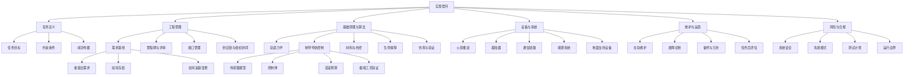
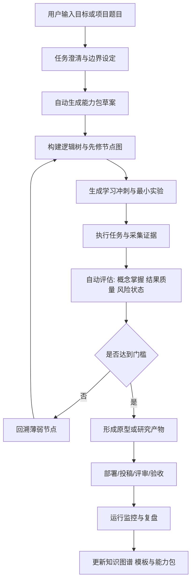

# 面向能力包的元学习与项目驱动全周期体系研究报告

## 执行摘要

本报告提出一种比“章节式、低频反馈、单学科串行推进”更高效的组织方式：以**项目目标**作为学习与执行的顶层约束，把能力视为一个可组合、可验证、可治理的“能力包”，其最小闭环由**知识、数据、设备、组织能力**四层共同组成。学习不再以“学过”为终点，而以“能否把原理转成模型、把模型转成实验、把实验转成交付、把交付转成迭代”来判定。该思路与认知科学中对高效学习的证据高度一致：practice testing 与 distributed practice 被评为高效用策略，test-enhanced learning 在延时保持上优于反复阅读，而问题驱动/项目驱动学习能够促进灵活知识、自主学习与问题解决。citeturn14view3turn14view2turn31view0

核心判断有三点。第一，**元学习的单位应从“章节”切换为“任务—证据—决策”闭环**；第二，**知识图谱/逻辑树不应只是记忆结构，而应成为需求、假设、实验、风险、交付物之间的索引系统**；第三，**商业、学术、大工程不是同一种项目管理的不同皮肤，而是三种不同的最优化函数**：商业优化市场验证速度与资源回收，学术优化可证伪性、可复现性与知识贡献，大工程优化系统安全、接口一致性与全寿命周期成功率。citeturn21view0turn21view1turn24view2turn24view1turn18view0turn18view1

因此，最优体系不是“把 AI 加到传统教育上”，而是重建一个**项目中台**：它既能做原理穿透、前置实验、证据归档、任务拆解、多人协同、合规闸门，也能在每次失败后自动更新逻辑树与下一轮冲刺计划。该方向也与用户上传草案中关于“脚手架、证据链、分权限角色、可视化逻辑树”的要求一致，但本报告将其进一步提升为**能力包驱动的全周期操作系统**，而不是单一课程或单一学科的辅助工具。fileciteturn0file0

## 核心模型与根本判断

传统教育的主要低效，并不在于有学科边界，而在于它常把**知识输入、能力形成、实验检验、真实落地**切成彼此断裂的阶段：先按章节被动学习，再在很晚的时间点做少量题目或考试，导致反馈太迟、迁移太弱、错误暴露成本太高。与此相对，认知与教育研究更支持一种“在解决问题中学习、在检索中巩固、在解释中深化、在间隔与交错中稳定”的路线。Dunlosky 等综述指出 practice testing 与 distributed practice 具有高效用，self-explanation 与 interleaving 也有中等以上潜力；Roediger 与 Karpicke 则显示，短期内重读可能看似更顺，但延时保持上测试显著更强；Hmelo-Silver 对 PBL 的综述进一步表明，复杂问题与自定向学习有助于形成灵活知识与终身学习能力。citeturn14view3turn14view2turn31view0

因此，本文把“渗透式学习”定义为一种**多上下文反复穿透**的算法，而不是简单的 A→B→C 直线推进。一个关键概念至少要在六种场景里被反复请求：**解释、推导、比较、实验、部署、复盘**。只有当学习者既能说清“是什么”，又能说明“为什么成立、依赖哪些假设、如何失效、如何验证、如何替代”，概念才算真正进入能力层，而不是停留在名词层。citeturn14view3turn14view2turn31view0

基于这一点，本文建议把项目全周期抽象为如下七步闭环：**问题定义 → 原理建模 → 最小实验 → 工程实现 → 场景落地 → 运行监控 → 复盘迭代**。在商业场景，这七步会更强调客户与价值假设；在学术场景，会更强调方法严谨、可复现与数据治理；在大工程场景，则更强调需求基线、接口控制、验证矩阵与全寿命周期维护。SEBoK 将 systems engineering 定义为一种覆盖问题发现、解决方案定义与实现、运行、维持与退役的跨学科方法；NASA 的 handbook 也把 program/project lifecycle、system design、product realization 与 crosscutting technical management 串成一个体系，而非线性文档流程。citeturn18view0turn19view0

把这个闭环落到执行层，能力包可以被定义为：**为完成一个项目目标而必须同时具备的最小知识结构、最小数据资产、最小设备环境和最小组织机制**。它不是“资源越多越好”的堆砌，而是围绕目标对象的**最小充分集合**。例如做“医学影像分类原型”，知识包至少包括任务定义、评价指标与错误类型；数据包至少包括数据字典、标注协议与质检；设备包至少包括计算环境与版本锁定；组织包则至少包括角色分工、审查点与复盘节奏。这个“四件套”缺一，项目都会在不同阶段失速。citeturn24view1turn24view0turn18view0turn39view0turn41view0

下表给出一个可直接用于产品与团队运行的能力包分解模板。该表是本文的分析性综合框架，时间线按**无特定预算约束、以 12 周为一轮**设置，适合作为 AI 学习辅助软件中的默认项目模板。

| 能力层 | 核心对象 | 典型交付物 | 关键度量指标 | 建议时间线 |
|---|---|---|---|---|
| 知识 | 原理、概念边界、假设、推导链、失败模式 | 逻辑树、先修图、关键概念闭环卡、FAQ、推导笔记、错误案例库 | 概念解释正确率、迁移题通过率、反例识别率、闭环完成率 | 第 1–2 周建立骨架，第 3–12 周持续修订 |
| 数据 | 样本、文献、规范、日志、标注、证据 | 数据卡、证据库、文献矩阵、标签规范、质量报告、漂移报告 | 覆盖率、缺失率、一致性、可追溯率、版本可复现性 | 第 1–4 周建库，第 5–12 周滚动扩充 |
| 设备 | 软件环境、实验平台、仿真/硬件、仪器/SOP | 环境清单、部署脚本、校准记录、基准测试、运行监控面板 | 配置成功率、实验复现率、平均恢复时间、稳定运行时长 | 第 2–5 周完成最小可用环境，第 6–12 周优化 |
| 组织能力 | 角色、流程、评审、运营、激励、合规 | WBS、RACI、风险台账、审查门、会议纪要、决策日志、复盘模板 | 决策延迟、阻塞时长、缺陷逃逸率、迭代周期、复盘关闭率 | 第 1 周设定规则，第 2–12 周按周运行 |

表中交付物与度量逻辑综合了高效学习策略、研究数据治理、系统工程和 AI 治理的共同要求：学习层强调 practice testing、distributed practice、self-explanation 与 PBL；数据层强调 FAIR 与 NIH 风格的数据管理/共享责任；工程与组织层强调 systems engineering、AIMS、验证与治理。citeturn14view3turn14view2turn31view0turn24view0turn25view1turn18view0turn39view0turn40view0

## 商业 学术 大工程框架对比与合规要点

商业、学术、大工程的差异，不是“领域不同”这么简单，而是**项目最小真相单位**不同。商业的真相单位是“客户是否愿意持续付费或持续使用”；学术的真相单位是“结论是否可证伪、可复现、可共享”；大工程的真相单位是“系统是否在既定边界条件下安全、可靠、可维护地工作”。因此，三者虽然都需要学习闭环，但**证据标准、迭代节奏、失败容忍边界、治理强度**不同。Agile Manifesto 强调个体互动、可工作的软件、客户协作与响应变化；NSF I-Corps 则把科研成果外推到市场时压缩为一套 7 周的沉浸式创业训练；学术侧越来越强调 preregistration、数据共享、FAIR 与公开透明；大工程侧则明显更靠近 systems engineering 的全寿命周期观。citeturn21view0turn21view1turn24view2turn24view1turn24view0turn18view0turn19view0

| 比较维度 | 商业框架 | 学术生产框架 | 大工程框架 |
|---|---|---|---|
| 首要目标 | 需求/价值验证、现金流与可扩展性 | 新知识、可复现性、方法严谨性 | 任务成功、安全、寿命周期一致性 |
| 最小真相单位 | 用户问题、转化、留存、付费、采用 | 研究问题、假设、数据、方法、证据 | 需求、接口、风险、验证项、运行工况 |
| 学习单位 | 假设—实验—反馈 | 问题—方法—数据—分析—复现 | 需求—架构—子系统—验证—运维 |
| 迭代节奏 | 周或双周冲刺，快速试错 | 里程碑式推进，但关键节点前置审查 | 阶段门+技术评审，局部可迭代、整体验证更严格 |
| 失败容忍 | 早期高，越接近正式上线越低 | 假设失败可接受，数据与伦理不合规不可接受 | 子系统试验可失败，系统级失效容忍度极低 |
| 主要证据 | Customer discovery、使用数据、A/B、交付速度 | 预注册、方法透明、数据治理、可复现结果 | 需求追踪、V&V、审查记录、配置与风险控制 |
| 关键组织机制 | 产品负责人、客户访谈、运营闭环 | PI/课题负责人、IRB/伦理、数据与论文流程 | 系统工程、配置管理、接口控制、技术审查 |
| 常见误区 | 只做功能、不做问题验证 | 只做论文、不做证据治理与可复现 | 只做文档、不做早期集成与持续验证 |

上表的框架依据分别来自 Agile、I-Corps、学术预注册与数据共享/FAIR、以及 SEBoK/NASA 体系；其差异性的关键不是话术，而是信号结构本身。citeturn21view0turn21view1turn24view2turn25view1turn24view0turn18view0turn19view0

如果项目涉及人类受试者、个人数据或高风险 AI 决策，三类框架都必须再叠加合规层。Belmont Report 识别了**尊重人格、行善、正义**三原则，并把它们落到**知情同意、风险/收益评估、受试者选择**三个应用域；European Commission 对 GDPR 的解释指出，能识别个体的信息以及可再识别的假名化数据仍属于个人数据，而收集、组织、存储、使用、披露等都属于数据处理；NIST AI RMF 则是一个面向设计、开发、使用与评估全过程的自愿性风险管理框架；EU AI Act 则进一步把 AI 划分为禁止实践、高风险系统与通用目的 AI 等不同监管层级；ISO/IEC 42001 把组织级 AI 治理收束到 AIMS 与持续改进；Fed SR 11-7 则为高风险模型场景给出了“开发/使用—验证—治理—独立挑战”的治理骨架。citeturn42view0turn42view1turn42view2turn42view3turn6view0turn41view0turn4view3turn4view4turn4view5turn39view0turn40view0turn40view2

| 触发条件 | 必须叠加的框架 | 软件内部必须内置的控制点 |
|---|---|---|
| 人类受试者研究 | Belmont / IRB 逻辑 | 受试者标识、知情同意记录、风险收益说明、受试者招募公平性检查 |
| 个人数据或可再识别数据 | GDPR 类数据保护框架 | 数据分级、用途标注、最小化收集、访问控制、留痕与删除策略 |
| 生成式 AI 或决策 AI | NIST AI RMF；在欧盟部署时叠加 AI Act | 风险画像、模型卡、数据谱系、使用边界、输出监测、人工复核点 |
| 企业级长期运营 | ISO/IEC 42001 | AIMS、PDCA、职责矩阵、审计日志、例外管理、持续改进 |
| 高后果模型应用 | SR 11-7 风格治理 | 独立验证、有效挑战、模型库存、限制条件、监控与重验证 |

表中控制点的共同精神很明确：**高风险不是多写一份文档，而是把“证据、审查、边界、问责”编码进系统本身**。citeturn42view1turn42view2turn6view0turn41view0turn39view0turn40view1turn40view2

## 能力包分解 逻辑树与学科映射

在方法学上，能力包的核心不是把知识堆得更多，而是把项目对象展开成一个**无限可嵌套的逻辑树**：每个节点都能继续拆成“目标、约束、原理、变量、设备、数据、组织、维护、风险、验证、证据”。这样做的意义是，学习者在任何层级都能同时保有**总工视角**与**可实验视角**。SEBoK 把 systems engineering 视为一种跨学科、跨寿命周期的问题发现与解决方案实现方法；PBL 则证明，把知识放回复杂问题情景中更利于形成灵活知识与自定向学习。citeturn18view0turn31view0

下图给出“如何实现登月”的逻辑树示意。这里的重点不是“航天知识本身”，而是演示一种可以**无限下钻**的元学习与项目拆解方式。官方图示参考可直接查看 NIST AI RMF 与 NASA Systems Engineering Handbook 页面；下图是面向软件交互实现的重绘示意。citeturn41view0turn18view1



把这种逻辑树用于 AI 学习辅助软件时，应把每个节点绑定四类对象：**证据、任务、风险、交付物**。节点不是孤立知识点，而是“一个待证明、待执行、待治理的微项目”。当某节点的证据不足、实验失败或先修依赖断裂时，系统应自动回溯到上游节点，而不是继续往下“假装理解”。这正是“长链深链”的真实含义：不是生成更长的文字链，而是维持更长的**因果链、假设链、验证链、治理链**。citeturn18view0turn40view0

不同学科的差别，更多体现为**模式识别对象不同**，而不是元学习机制不同。下面给出一个适合软件实现的“通用能力指标 + 学科特定模式识别”模板。该表中的学科模式是本文在通用框架基础上的分析性派生，用于产品设计与训练指标设定，不等同于完整监管清单。

| 学科领域 | 通用能力指标 | 该学科最关键的模式识别 | 建议的项目化学习产物 |
|---|---|---|---|
| 医学 | 证据等级判断、风险收益权衡、异常值与误诊模式识别、沟通与记录 | 症状—机制—诊断—干预链；敏感性/特异性；不良事件；人类受试者保护 | 病例树、诊疗证据矩阵、同意与隐私检查单、误诊复盘库 |
| 生物 | 实验设计、对照设置、噪声/批次效应识别、可复现实验记录 | 基因/通路—表型—实验条件链；标注与样本偏差；数据共享与溯源 | 实验协议树、对照表、样本谱系、可复现实验包 |
| 轻工 | 工艺理解、质量控制、设备节拍、成本与良率平衡 | 工艺窗口、SPC、缺陷模式、SOP 漂移、设备稼动率 | 工艺树、质控图、SOP 演化记录、异常工单库 |
| 航天 | 需求分解、接口管理、边界条件分析、冗余与维护设计 | 质量/功耗/热/可靠性/任务窗口耦合；失效模式；验证矩阵 | 需求追踪矩阵、接口控制文档、误差预算表、验证计划 |

医学/生物侧尤其需要把 Belmont、数据治理与知情同意作为训练指标的一部分，而不是交给“项目结束后补文书”；航天/大工程侧则必须把需求、接口、验证和运维前置为核心认知对象。citeturn42view1turn42view2turn42view3turn25view1turn18view0turn19view0

## AI学习辅助软件交互逻辑详案

软件本身不应是“问答机器人”，而应是一个**能力包编排器**。它的第一职责不是给答案，而是把一个模糊目标转成：**逻辑树、任务流、证据库、实验计划、合规点、协作分工、反馈回路**。在交互上，系统要隐含两套角色：一套是“教练/总工/PI/产品经理”式推进角色；另一套是“审稿人/验证者/红队/合规官”式挑战角色。Fed SR 11-7 对高后果模型特别强调有效挑战、独立验证与持续监测；ISO/IEC 42001 与 NIST AI RMF 也都强调把风险管理嵌入全流程，而不是放在项目尾部。citeturn40view1turn40view2turn39view0turn41view0

### 用户旅程与系统主流程



这条用户旅程的关键，不在“生成内容速度”，而在**每一步都要留下证据与状态**。尤其是回溯逻辑必须自动化：如果评估未达门槛，系统不能只说“请继续学习”，而应明确指出是**哪一个先修节点断裂、哪一类实验不足、哪一个证据冲突尚未解决**。渗透式学习不是允许无限前进，而是允许**无限回溯直到结构稳定**。citeturn14view3turn14view2turn31view0turn40view0

### 界面模块与关键草图

面向高阶学习者与科研/工程/企业团队，建议至少包含以下六个主界面模块。

| 模块 | 目的 | 关键控件 | 自动化动作 |
|---|---|---|---|
| 项目驾驶舱 | 看全局目标、阶段、风险、阻塞 | 目标卡、阶段门、里程碑、健康状态 | 自动汇总任务、证据、风险、下一步 |
| 逻辑树工作台 | 看知识与任务结构 | 节点图、先修依赖、证据强度、反例 | 自动展开节点、识别依赖缺口 |
| 证据库 | 管理文献、数据、实验、会议纪要 | 文献卡、数据卡、版本、来源 | 自动抽取 claim、证据链接与冲突点 |
| 实验与原型台 | 组织实验、仿真、代码、部署 | 实验模板、指标面板、回滚 | 自动记录参数、结果、失败类型 |
| 合规与治理台 | 管理受试者、隐私、AI 风险、审批 | 同意记录、权限、审查门、审计日志 | 自动触发合规检查与审批流 |
| 复盘与模板库 | 沉淀经验与可复用资产 | 失败模式、最佳实践、模板 | 自动把复盘结果回写到项目模板 |

这些模块吸收了用户草案中“脚手架模式、三阶段提示、证据链、角色权限”的思路，但把它从提示工程升级为**可审计、可协作、可治理的产品结构**。fileciteturn0file0

一个关键界面可以这样布局：

```text
┌────────────────────────────────────────────────────────────┐
│ 顶栏：项目目标｜阶段门｜风险等级｜最近决策｜协作者状态      │
├───────────────┬──────────────────────────────┬───────────────┤
│ 左侧：逻辑树   │ 中央：当前节点工作区           │ 右侧：证据与评估 │
│ - 总目标       │ - 原理解释                     │ - 文献/数据卡     │
│ - 先修节点     │ - 关键变量                     │ - 掌握度评分      │
│ - 依赖关系     │ - 最小实验                     │ - 冲突证据        │
│ - 风险标签     │ - 任务拆解                     │ - 合规提醒        │
├───────────────┴──────────────────────────────┴───────────────┤
│ 底栏：本轮冲刺任务｜阻塞项｜自动建议下一步｜复盘入口         │
└────────────────────────────────────────────────────────────┘
```

这个布局的重点是让“学习”和“做事”不再分屏：左侧是结构，中间是执行，右侧是证据与评估。用户不应在“学知识”和“跑项目”之间切换上下文，而应在同一界面中完成原理穿透、实验设计、任务拆分和证据归档。citeturn14view3turn31view0turn18view0

### 提示工程与示例模板

提示工程不应该只围绕“帮我回答”，而应围绕“帮我形成闭环”。因此建议预置以下模板。

| 场景 | 提示模板 |
|---|---|
| 原理穿透 | “请把【目标】展开为三级逻辑树：原理、关键变量、可验证实验。每个节点给出先修知识、常见误解和最小证明任务。” |
| 节点补洞 | “针对【当前节点】，找出上游缺失的三个先修节点，并给出 48 小时内可完成的补洞计划。” |
| 实验设计 | “围绕【假设】设计最小可证伪实验：变量、对照、指标、成功阈值、失败后回溯路径。” |
| 落地计划 | “把【原理/模型】转成落地路线：原型、部署、监控、维护、迭代。列出必须的设备、数据和组织能力。” |
| 合规检查 | “若该任务涉及受试者/个人数据/高风险 AI，请列出需要增加的审批、记录、留痕与人工复核节点。” |
| 复盘升级 | “基于本轮失败记录，更新逻辑树中的错误模式、证据冲突和下一轮冲刺路线。” |

一个简短的对话示例如下：

> **用户**：我要做“AI 辅助病理图像筛查”的学习与原型项目。  
> **系统**：先把项目切为四个能力包：病理学基础与评价指标、样本/标注与数据治理、训练/推理环境、角色与合规流程。高风险点包括人类数据、潜在辅助诊断场景与模型偏差，因此系统将自动加入隐私与人工复核门。接下来我先展开逻辑树，再给你 2 周学习冲刺与 1 个最小实验。citeturn42view1turn6view0turn41view0

### 多模态输入输出与自动化工作流

由于用户面对的不是单一文本任务，软件必须从设计上支持多模态。

| 输入模态 | 典型来源 | 系统应做什么 |
|---|---|---|
| 文本 | 题目、需求、备忘、日志 | 抽取目标、约束、任务与决策 |
| PDF/论文/规范 | 论文、手册、法规 | 抽取 claim、方法、指标、合规点 |
| 表格/CSV | 数据集、实验记录、财务/运营数据 | 生成数据卡、质量报告、指标趋势 |
| 图像/图表 | 医学图像、工艺缺陷图、系统图 | 关联到节点与实验，支持标注与比对 |
| 代码/脚本 | 原型、分析程序、仿真脚本 | 绑定版本、环境、结果与回滚信息 |
| 音视频/会议纪要 | 讨论、评审、访谈 | 摘要为决策日志与待办 |
| 传感器/设备日志 | 工程设备、实验平台 | 自动生成异常报告与维护任务 |

相应输出则不应只是一段答案，而应至少包括：**逻辑树、任务板、证据矩阵、实验协议、风险面板、复盘报告、模板资产**。当项目切换到商业/学术/大工程三种模式时，输出物默认不同：商业模式偏向问题访谈脚本、MVP 计划和运营指标；学术模式偏向方法、数据、复现与论文结构；大工程模式偏向需求追踪、接口清单、验证矩阵和维护计划。citeturn21view1turn24view2turn25view1turn18view0

### 技术实现建议

在不限制具体厂商的前提下，建议采用“**LLM 编排层 + 图数据库/知识图谱层 + 文档与向量检索层 + 项目工作流引擎 + 合规策略引擎 + 指标存储层**”的六层架构。若项目涉及多人协作，还应加入 RBAC、审计日志、审批流和模型/数据版本管理。高风险场景下，系统必须支持独立验证、人机双签、红队和审查门，这些不是“高级功能”，而是治理底座。citeturn39view0turn40view1turn40view2turn41view0

## 干扰排除 执行与迭代优化

高阶项目学习的最大敌人通常不是“不会”，而是**上下文切换、目标模糊、反馈稀疏、过早追求完整、健康状态下滑**。所以，优化不是先加更多资源，而是先减少无效摩擦。本文建议把干扰控制拆成四层：**环境层、计划层、行为层、反馈层**。环境层处理通知、社交媒体、会议碎片化和文件混乱；计划层处理目标过大和任务不可执行；行为层处理睡眠、运动、执行惯性；反馈层处理“做了很多但不知道是否变强”。CDC 指出良好睡眠对健康、情绪、注意力和记忆都很关键，并给出成人通常需要 7 小时以上睡眠的建议；WHO 与 CDC 也都指出规律身体活动能改善思维、情绪和睡眠。citeturn36view0turn36view1turn35view0turn36view2turn36view4

在计划层，最有效的方法不是写更长的待办清单，而是为每轮冲刺只设定三类任务：**一个穿透原理、一个最小实验、一个交付物**。如果 24–72 小时内无法看到任何证据变化，任务就拆得还不够小。对于执行惯性，可以采用“如果—那么”计划：例如“如果我打开项目驾驶舱后的 5 分钟内还没开始，就先完成第一个节点的口头解释并提交 1 条证据”。这类 implementation intentions 的作用，在于把模糊意愿变成具体触发器与动作。citeturn38search0turn34search2

下面给出一份可直接内置到软件中的操作清单。

| 干扰类别 | 典型症状 | 处理动作 | 可监控指标 |
|---|---|---|---|
| 目标过大 | 计划写满但无法启动 | 压缩成 72 小时内可完成的最小实验 | 首次交付时间、拖延时长 |
| 先修断裂 | 越学越乱、解释不清 | 自动回溯 1–3 个先修节点并先补洞 | 节点回溯次数、补洞完成率 |
| 信息过载 | 文献很多但无法决策 | 强制每条资料落到“支持/反对/待验证”三栏 | 证据转化率、未分类资料比例 |
| 上下文切换 | 同时开多个任务，推进缓慢 | 每个冲刺只保留一条主线、一条副线 | 任务切换次数、阻塞时长 |
| 执行疲劳 | 学习时间长但质量下降 | 固定睡眠锚点、短时活动、限制晚间屏幕 | 睡眠时长、连续专注时段 |
| 虚假掌握 | 看懂但不会做 | 强制输出解释、反例、实验设计 | 解释正确率、迁移题正确率 |

真正的优化，不是提高主观忙碌感，而是提高**闭环密度**：每单位时间里，用户完成了多少次“提出假设—验证—修正—沉淀”的循环。若软件只能提升资料获取速度、却不能提升闭环密度，它就仍然停留在“传统教育的信息化”，而不是“能力包的项目操作系统”。citeturn14view2turn14view3turn31view0turn18view0

## 局限与待补问题

本报告优先给出了可迁移的**元框架**，而没有把所有行业法规逐项展开；这意味着当项目进入真实部署时，仍需按行业补充绑定规则，例如医疗、金融、航空航天、教育评测等场景的专门规范。尤其是当系统进入**人类受试者、个体画像、自动化高后果决策**情境时，必须把 Belmont、数据保护制度与 AI 风险管理从“建议”提升为“上线前门槛”。citeturn42view1turn42view2turn41view0turn4view3turn4view4

另一个局限是，部分国际标准全文受付费或访问限制影响，本文主要依据官方简介、开放网页、法规文本与论文摘要进行综合；因此，若你的目标是建立可外部审计的正式制度，下一步应将本报告中的模板映射到你所在组织适用的正式制度文本和法务审查流程中。citeturn39view0turn41view0turn40view2

## BibTeX 文献列表

以下条目优先收录官方法规、标准、权威框架与具有代表性的研究论文，格式可直接导入 Zotero、JabRef 或 BibLaTeX。

```bibtex
@article{Dunlosky2013,
  author    = {John Dunlosky and Katherine A. Rawson and Elizabeth J. Marsh and Mitchell J. Nathan and Daniel T. Willingham},
  title     = {Improving Students' Learning With Effective Learning Techniques: Promising Directions From Cognitive and Educational Psychology},
  journal   = {Psychological Science in the Public Interest},
  volume    = {14},
  number    = {1},
  pages     = {4--58},
  year      = {2013},
  doi       = {10.1177/1529100612453266}
}

@article{RoedigerKarpicke2006,
  author    = {Henry L. Roediger III and Jeffrey D. Karpicke},
  title     = {Test-Enhanced Learning: Taking Memory Tests Improves Long-Term Retention},
  journal   = {Psychological Science},
  volume    = {17},
  number    = {3},
  pages     = {249--255},
  year      = {2006},
  doi       = {10.1111/j.1467-9280.2006.01693.x}
}

@article{HmeloSilver2004,
  author    = {Cindy E. Hmelo-Silver},
  title     = {Problem-Based Learning: What and How Do Students Learn?},
  journal   = {Educational Psychology Review},
  volume    = {16},
  number    = {3},
  pages     = {235--266},
  year      = {2004},
  doi       = {10.1023/B:EDPR.0000034022.16470.f3}
}

@article{Wilkinson2016,
  author    = {Mark D. Wilkinson and Michel Dumontier and IJsbrand Jan Aalbersberg and others},
  title     = {The FAIR Guiding Principles for Scientific Data Management and Stewardship},
  journal   = {Scientific Data},
  volume    = {3},
  pages     = {160018},
  year      = {2016},
  doi       = {10.1038/sdata.2016.18}
}

@misc{AgileManifesto2001,
  author    = {{Beck, Kent and others}},
  title     = {Manifesto for Agile Software Development},
  year      = {2001},
  howpublished = {\url{https://agilemanifesto.org/}},
  note      = {Official manifesto website}
}

@misc{NSFICorps,
  author    = {{U.S. National Science Foundation}},
  title     = {NSF I-Corps},
  year      = {2026},
  howpublished = {\url{https://www.nsf.gov/funding/initiatives/i-corps}},
  note      = {Official program page}
}

@misc{Belmont1979,
  author    = {{U.S. Department of Health, Education, and Welfare}},
  title     = {The Belmont Report: Ethical Principles and Guidelines for the Protection of Human Subjects of Research},
  year      = {1979},
  howpublished = {\url{https://www.hhs.gov/ohrp/regulations-and-policy/belmont-report/read-the-belmont-report/index.html}},
  note      = {Official HHS publication}
}

@misc{GDPR2016,
  author    = {{European Union}},
  title     = {Regulation (EU) 2016/679 of the European Parliament and of the Council},
  year      = {2016},
  howpublished = {\url{https://eur-lex.europa.eu/eli/reg/2016/679/oj/eng}},
  note      = {General Data Protection Regulation}
}

@misc{ECAIDataProtectionExplained,
  author    = {{European Commission}},
  title     = {Data Protection Explained},
  year      = {2026},
  howpublished = {\url{https://commission.europa.eu/law/law-topic/data-protection/data-protection-explained_en}},
  note      = {Official explanatory page}
}

@misc{EUAIAct2024,
  author    = {{European Union}},
  title     = {Regulation (EU) 2024/1689 Laying Down Harmonised Rules on Artificial Intelligence},
  year      = {2024},
  howpublished = {\url{https://eur-lex.europa.eu/eli/reg/2024/1689/oj/eng}},
  note      = {EU AI Act}
}

@misc{NISTAIRMF2023,
  author    = {{National Institute of Standards and Technology}},
  title     = {AI Risk Management Framework},
  year      = {2026},
  howpublished = {\url{https://www.nist.gov/itl/ai-risk-management-framework}},
  note      = {Official NIST framework portal; AI RMF 1.0 released 2023}
}

@misc{ISO42001,
  author    = {{International Organization for Standardization and International Electrotechnical Commission}},
  title     = {ISO/IEC 42001:2023 Information Technology --- Artificial Intelligence --- Management System},
  year      = {2023},
  howpublished = {\url{https://www.iso.org/standard/42001}},
  note      = {Official standard page}
}

@misc{FedSR117,
  author    = {{Board of Governors of the Federal Reserve System}},
  title     = {Supervisory Letter SR 11-7 on Guidance on Model Risk Management},
  year      = {2011},
  howpublished = {\url{https://www.federalreserve.gov/supervisionreg/srletters/sr1107.htm}},
  note      = {Official supervisory guidance}
}

@misc{SEBoK2025,
  author    = {{SEBoK Editorial Board}},
  title     = {Guide to the Systems Engineering Body of Knowledge (SEBoK)},
  year      = {2025},
  howpublished = {\url{https://sebokwiki.org/wiki/Guide_to_the_Systems_Engineering_Body_of_Knowledge_(SEBoK)}},
  note      = {Official SEBoK website}
}

@misc{NASASystemsEngineeringHandbook,
  author    = {{National Aeronautics and Space Administration}},
  title     = {Systems Engineering Handbook},
  year      = {2019},
  howpublished = {\url{https://www.nasa.gov/reference/systems-engineering-handbook/}},
  note      = {NASA handbook web edition}
}

@misc{NIHDataSharing,
  author    = {{National Institutes of Health}},
  title     = {Scientific Data Sharing: Policies and Access to Data},
  year      = {2026},
  howpublished = {\url{https://grants.nih.gov/policy-and-compliance/policy-topics/sharing-policies}},
  note      = {Official NIH policy portal}
}

@misc{COSPreregistration,
  author    = {{Center for Open Science}},
  title     = {Preregistration},
  year      = {2026},
  howpublished = {\url{https://www.cos.io/initiatives/prereg}},
  note      = {Official COS guidance page}
}

@misc{WHOPhysicalActivity2024,
  author    = {{World Health Organization}},
  title     = {Physical Activity},
  year      = {2024},
  howpublished = {\url{https://www.who.int/news-room/fact-sheets/detail/physical-activity}},
  note      = {WHO fact sheet}
}

@misc{CDCSleep2024,
  author    = {{Centers for Disease Control and Prevention}},
  title     = {About Sleep},
  year      = {2024},
  howpublished = {\url{https://www.cdc.gov/sleep/about/index.html}},
  note      = {Official CDC page}
}

@misc{CDCPhysicalActivityBenefits2024,
  author    = {{Centers for Disease Control and Prevention}},
  title     = {Benefits of Physical Activity},
  year      = {2024},
  howpublished = {\url{https://www.cdc.gov/physical-activity-basics/benefits/index.html}},
  note      = {Official CDC page}
}

@article{Peffers2007,
  author    = {Ken Peffers and Tuure Tuunanen and Marcus A. Rothenberger and Samir Chatterjee},
  title     = {A Design Science Research Methodology for Information Systems Research},
  journal   = {Journal of Management Information Systems},
  volume    = {24},
  number    = {3},
  pages     = {45--77},
  year      = {2007},
  doi       = {10.2753/MIS0742-1222240302}
}
```