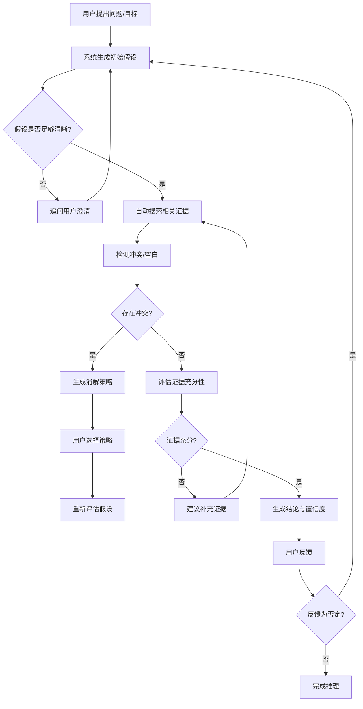

# v1.6 开发文档：因果推理与主动思考引擎

> 本版本将逻辑推理从"知识网络分析"升级为"因果推断与主动思考工作台"，支持分布误差校验、多跳导航、冲突检测闭环，并整合 Pearl 因果阶梯与多种推理范式。
>
> **重要约束**：
> - 所有引用和修改的库必须为**开源 MIT 协议**
> - 所有 API 接口必须模块化管理，提供接口管理文档
> - 采用模块化开发，避免堆砌式实现

---

## 0. 总体架构升级

### 0.1 设计理念

v1.6 的核心目标是构建一个**通用但不专精深**的推理引擎，让用户能够：
1. **主动探索**：通过多跳导航发现知识间的隐式关联
2. **严谨校验**：对推理过程进行分布误差检测
3. **冲突消解**：自动识别并提示矛盾证据
4. **迭代深化**：支持从观察到干预到反事实的完整闭环

### 0.2 推理引擎四层架构

```text
┌─────────────────────────────────────────────────────────────┐
│              L4: 复杂推演层 (Complex Reasoning)            │
│  - ACH 结构化分析          - 假设检验框架                  │
│  - 高阶信念网络            - 博弈论推理                    │
├─────────────────────────────────────────────────────────────┤
│              L3: 因果推断层 (Causal Inference)             │
│  - 反事实推理              - 干预分析 (do-calculus)        │
│  - 工具变量识别            - 中介分析                      │
├─────────────────────────────────────────────────────────────┤
│              L2: 概率编程层 (Probabilistic Programming)    │
│  - 贝叶斯网络              - 概率图模型                    │
│  - 分布误差校验            - 不确定性传播                  │
├─────────────────────────────────────────────────────────────┤
│              L1: 知识网络层 (Knowledge Network)            │
│  - 多跳路径导航            - 节点重要性分析                │
│  - 证据链构建              - 冲突检测                      │
└─────────────────────────────────────────────────────────────┘
```

### 0.3 与 Pearl 因果阶梯的映射

| 层级 | Pearl 阶梯 | v1.6 能力 | 工具链 |
|---|---|---|---|
| L1 | 关联 (Association) | 知识网络分析、多跳导航、统计共现 | NetworkX、PyTorch Geometric |
| L2 | 干预 (Intervention) | do-算子、控制变量、实验设计 | CausalPy、DoWhy |
| L3 | 反事实 (Counterfactual) | 反事实假设、边界条件、鲁棒性测试 | Pyro、NumPyro |
| L4 | 高阶推理 | ACH、假设检验、信念修正 | 自定义 + LangChain |

---

## 1. 多跳导航引擎

### 1.1 功能设计

- **路径发现**：自动发现两节点间的所有路径（最短路径、k-最短路径）
- **路径评分**：基于证据强度、节点重要性、路径长度综合评分
- **隐式关联挖掘**：发现间接关联（A→B→C 中 A 与 C 的关系）
- **路径可视化**：在 3D 图谱中高亮显示路径

### 1.2 核心算法

```ts
export interface Path {
  nodes: string[];
  edges: string[];
  score: number; // 综合评分 0-1
  length: number;
  evidenceStrength: number;
}

export interface PathQuery {
  source: string;
  target: string;
  maxLength: number;
  includeIndirect: boolean;
  scoringMethod: 'shortest' | 'evidence' | 'balanced';
}
```

### 1.3 工具链与实现

| 功能 | 推荐工具 | 说明 |
|---|---|---|
| 图算法 | **NetworkX** | 路径查找、中心性分析 |
| 图嵌入 | **PyTorch Geometric / DGL** | 节点嵌入用于隐式关联 |
| 路径评分 | 自定义 | 基于证据链强度加权 |

### 1.4 改动文件

- `lib/graph-utils.ts`（多跳路径算法）
- `lib/embedding.ts`（图嵌入支持）
- `components/Graph3D.tsx`（路径高亮渲染）
- `components/LogicReasoningTab.tsx`（路径查询 UI）

### 1.5 验收

- [ ] 支持两节点间多跳路径查询
- [ ] 路径按综合评分排序
- [ ] 3D 图谱中高亮显示路径
- [ ] 支持间接关联发现（跳数 > 2）

---

## 2. 分布误差校验引擎

### 2.1 功能设计

- **统计分布校验**：检查数据/证据是否符合预期分布
- **误差传播分析**：追踪推理过程中的不确定性累积
- **置信区间估计**：为每个结论提供置信度
- **异常值检测**：识别离群证据点

### 2.2 核心数据结构

```ts
export interface Uncertainty {
  type: 'normal' | 'uniform' | 'beta' | 'custom';
  params: Record<string, number>; // 分布参数
  confidence: number; // 置信度 0-1
}

export interface InferenceStep {
  id: string;
  claim: string;
  evidenceIds: string[];
  uncertainty: Uncertainty;
  errorSources: string[];
}
```

### 2.3 工具链与实现

| 功能 | 推荐工具 | 说明 |
|---|---|---|
| 概率分布 | **SciPy** | 统计分布、假设检验 |
| 贝叶斯推理 | **PyMC3 / Stan** | 概率编程 |
| 误差传播 | 自定义 | 基于方差传播公式 |

### 2.4 改动文件

- `lib/statistics.ts`（统计检验工具）
- `lib/probability.ts`（概率分布处理）
- `lib/reasoning.ts`（推理过程不确定性追踪）
- `components/UncertaintyPanel.tsx`（误差可视化）

### 2.5 验收

- [ ] 对证据数据进行分布检验
- [ ] 为推理结论提供置信区间
- [ ] 可视化显示误差来源
- [ ] 异常值检测与标记

---

## 3. 冲突检测闭环

### 3.1 功能设计

- **证据冲突检测**：识别相互矛盾的证据
- **冲突分类**：事实冲突、逻辑冲突、概率冲突
- **冲突消解建议**：提供消解策略（获取更多证据、重新评估权重等）
- **闭环验证**：冲突解决后自动重新验证推理链

### 3.2 冲突类型

| 类型 | 描述 | 检测方法 |
|---|---|---|
| 事实冲突 | 两个证据直接矛盾 | 逻辑否定检测 |
| 逻辑冲突 | 推理链内部不一致 | 一致性检查算法 |
| 概率冲突 | 概率分布不兼容 | 卡方检验、KS检验 |
| 来源冲突 | 证据来源可信度差异 | 来源评分对比 |

### 3.3 核心数据结构

```ts
export interface Conflict {
  id: string;
  type: 'fact' | 'logic' | 'probability' | 'source';
  evidenceA: string;
  evidenceB: string;
  severity: 'low' | 'medium' | 'high';
  resolutionSuggestions: string[];
  status: 'detected' | 'resolved' | 'pending';
}
```

### 3.4 改动文件

- `lib/conflict-detection.ts`（冲突检测算法）
- `lib/evidence-chain.ts`（证据链管理）
- `components/ConflictPanel.tsx`（冲突展示与消解）

### 3.5 验收

- [ ] 自动检测证据冲突
- [ ] 分类显示冲突类型与严重程度
- [ ] 提供消解建议
- [ ] 支持冲突解决后的重新验证

---

## 4. 主动思考支持系统

### 4.1 设计目标

让系统能够**模拟人的主动思考过程**：
1. 提出假设
2. 寻找证据
3. 发现矛盾
4. 修正假设
5. 迭代深化

### 4.2 主动思考工作流



### 4.3 思考模式切换

| 模式 | 触发条件 | 系统行为 |
|---|---|---|
| **探索模式** | 初始阶段/假设模糊 | 广度搜索、多假设并行 |
| **聚焦模式** | 假设明确 | 深度验证、证据求精 |
| **质疑模式** | 发现冲突 | 寻找反例、边界分析 |
| **整合模式** | 证据充分 | 综合评估、生成结论 |

### 4.4 改动文件

- `lib/active-thinking.ts`（主动思考状态机）
- `lib/question-generator.ts`（智能追问生成）
- `components/ThinkingModeSelector.tsx`（模式切换 UI）
- `components/HypothesisPanel.tsx`（假设管理面板）

### 4.5 验收

- [ ] 系统能主动提出追问澄清模糊点
- [ ] 支持探索/聚焦/质疑/整合四种思考模式
- [ ] 自动生成消解策略建议
- [ ] 支持假设迭代修正

---

## 5. 因果推断层整合

### 5.1 功能设计

- **do-算子支持**：对变量进行干预操作
- **工具变量识别**：自动识别有效的工具变量
- **中介分析**：分析因果路径中的中介效应
- **因果图构建**：从数据/知识中自动构建因果图

### 5.2 工具链选择

| 功能 | 推荐工具 | 说明 |
|---|---|---|
| 因果推断 | **DoWhy** | 端到端因果分析 |
| 结构学习 | **PyTorch Causal** | 因果图学习 |
| do-calculus | **CausalGraphicalModels** | 图模型操作 |

### 5.3 核心数据结构

```ts
export interface CausalGraph {
  id: string;
  nodes: string[];
  edges: { from: string; to: string; type: 'direct' | 'confounder' | 'mediator' }[];
  assumptions: string[]; // 因果假设
}

export interface Intervention {
  target: string;
  value: number | string;
  method: 'do' | 'condition' | 'instrumental';
  effectEstimate?: number;
  confidenceInterval?: [number, number];
}
```

### 5.4 改动文件

- `lib/causal-inference.ts`（因果推断工具）
- `lib/causal-graph.ts`（因果图管理）
- `components/CausalAnalysisPanel.tsx`（因果分析 UI）

### 5.5 验收

- [ ] 支持 do-算子干预分析
- [ ] 自动识别工具变量
- [ ] 支持中介效应分析
- [ ] 可视化因果图

---

## 6. 结构化分析层（ACH）

### 6.1 功能设计

- **ACH 方法支持**：分析竞争性假设
- **假设矩阵**：证据-假设关联矩阵
- **证据评分**：对证据可信度和相关性评分
- **假设排序**：基于证据支持度排序

### 6.2 ACH 工作流

```text
1. 提出竞争性假设 → 2. 列出证据 → 3. 关联证据与假设 → 
4. 评估证据可信度 → 5. 计算假设支持度 → 6. 敏感性分析
```

### 6.3 核心数据结构

```ts
export interface Hypothesis {
  id: string;
  text: string;
  alternatives: string[];
  status: 'active' | 'eliminated' | 'pending';
}

export interface EvidenceItem {
  id: string;
  text: string;
  source: string;
  credibility: number; // 可信度 0-1
  relevance: number;   // 相关性 0-1
}

export interface ACHMatrix {
  hypotheses: Hypothesis[];
  evidence: EvidenceItem[];
  links: { hypothesisId: string; evidenceId: string; supports: boolean; strength: number }[];
}
```

### 6.4 改动文件

- `lib/ach-analysis.ts`（ACH 算法）
- `components/ACHMatrix.tsx`（矩阵可视化）
- `components/HypothesisEvaluator.tsx`（假设评估）

### 6.5 验收

- [ ] 支持 ACH 竞争性假设分析
- [ ] 证据-假设矩阵可视化
- [ ] 自动计算假设支持度
- [ ] 敏感性分析支持

---

## 7. 实施顺序建议

| 阶段 | 任务 | 预计时间 | 依赖 |
|---|---|---|---|
| P0 | 多跳导航引擎 | 3–4 天 | NetworkX 集成 |
| P1 | 分布误差校验 | 3–4 天 | SciPy/PyMC3 |
| P2 | 冲突检测闭环 | 2–3 天 | 证据链系统 |
| P3 | 主动思考支持 | 3–4 天 | 状态机设计 |
| P4 | 因果推断层 | 4–5 天 | DoWhy 集成 |
| P5 | ACH 结构化分析 | 2–3 天 | 矩阵 UI |
| P6 | 文档与测试 | 2 天 | 所有模块 |

**总计约 3 周**（单人 OPC）

---

## 8. 风险与回退

| 风险 | 回退方案 |
|---|---|
| 因果推断库复杂难集成 | 先用简化版（仅支持条件干预），后续逐步增强 |
| 主动思考状态机复杂 | 先实现基础状态机，思考模式切换手动触发 |
| 性能问题 | 限制单次推理深度，添加推理缓存 |
| 概率编程学习曲线 | 先用 SciPy 做基础统计，PyMC3 作为可选扩展 |

---

## 9. 工具链清单（MIT 协议）

> **约束**：所有引用和修改的库必须为开源 MIT/BSD-3-Clause/Apache-2.0 协议。禁止使用 GPL/AGPL/LGPL 等传染性协议及商业闭源库。

### 因果推断
| 工具 | 协议 | 用途 | 接入方式 |
|---|---|---|---|
| DoWhy | MIT | 端到端因果分析 | Python API |
| CausalGraphicalModels | MIT | do-calculus、图模型 | Python API |
| EconML | MIT | 因果推断、异质性效应 | Python API |

### 图分析
| 工具 | 协议 | 用途 | 接入方式 |
|---|---|---|---|
| NetworkX | BSD-3-Clause | 路径查找、中心性分析 | Python API |
| PyTorch Geometric | MIT | 图嵌入、图神经网络 | Python API |
| DGL | Apache-2.0 | 深度学习图 | Python API |
| Graphviz | CPL | 图可视化 | CLI |


### 推理框架
| 工具 | 协议 | 用途 | 接入方式 |
|---|---|---|---|
| LangChain | MIT | Agent 编排 | Python |
| LangGraph | MIT | 状态机 | Python |
| LlamaIndex | MIT | 检索增强 | Python |

### 前端组件
| 工具 | 协议 | 用途 | 接入方式 |
|---|---|---|---|
| react-force-graph | MIT | 3D 图谱渲染 | npm |
| @react-three/fiber | MIT | WebGL 渲染 | npm |
| zustand | MIT | 状态管理 | npm |
| Dexie | Apache-2.0 | 本地数据库 | npm |

### 数据处理
| 工具 | 协议 | 用途 | 接入方式 |
|---|---|---|---|
| pandas | BSD | 数据处理 | pip |
| numpy | BSD | 数值计算 | pip |
| pydantic | MIT | 数据验证 | pip |

---

## 10. 超远关系连线面板

### 10.1 功能设计

- **多节点选中**：用户可在图谱中通过框选、Ctrl+点击等方式选中多个节点
- **默认直觉连接**：为选中节点直接创建超远关系连线，**无需额外关系描述**（默认为直觉连接）
- **关系类型标注**：可选为超远关系指定关系类型（因果、相关、对比、时序等）
- **证据关联**：为每个超远关系附加证据节点或文本说明
- **批量管理**：支持对已创建的超远关系进行批量查看、编辑、删除
- **与多跳导航联动**：多跳导航发现的路径可一键转为超远关系，在副视图中编辑

### 10.2 核心数据结构

```ts
export interface LongRangeRelation {
  id: string;
  sourceNodeId: string;
  targetNodeId: string;
  relationType: 'intuition' | 'causal' | 'correlation' | 'contrast' | 'temporal' | 'analogy' | 'custom';
  // 'intuition' 为默认直觉连接，无需额外描述
  relationLabel?: string;       // 自定义关系标签（仅 relationType='custom' 时使用）
  intermediatePath?: string[];  // 中间节点路径（可选，用于追溯）
  evidenceIds: string[];        // 关联的证据节点
  confidence: number;           // 置信度 0-1
  createdAt: number;
  updatedAt: number;
}

export interface MultiSelectState {
  selectedNodeIds: Set<string>;
  isSelecting: boolean;
  selectionBox?: { startX: number; startY: number; endX: number; endY: number };
}
```

### 10.3 UI 布局

```text
┌──────────────────────────────────────────────────────────────────┐
│  超远关系面板                                              [×]   │
├──────────────────────────────────────────────────────────────────┤
│  当前选中节点: [A] [B] [C]                           [清除选择] │
├──────────────────────────────────────────────────────────────────┤
│  关系构建模式:                                                   │
│  ● 默认直觉连接（直接连接，无需描述）                              │
│  ○ 自定义关系类型                                               │
├──────────────────────────────────────────────────────────────────┤
│  关系类型: [直觉 ▼]                                              │
│  （仅当选择"自定义关系类型"时可编辑）                            │
│  置信度: [====●====] 0.75                                        │
│  证据关联: [+ 添加证据]                                          │
├──────────────────────────────────────────────────────────────────┤
│  已创建的超远关系:                                                │
│  ┌────────────────────────────────────────────────────────────┐  │
│  │ A → D (直觉) 置信度: 0.85  [编辑] [删除]                  │  │
│  │ B ↔ C (对比) 置信度: 0.60  [编辑] [删除]                  │  │
│  └────────────────────────────────────────────────────────────┘  │
└──────────────────────────────────────────────────────────────────┘
```

### 10.4 与多跳导航联动

```text
┌─────────────────────────────────────────────────────────────────────┐
│                        主视图（主图谱）                             │
│  ┌─────────────────────────────────────────────────────────────┐   │
│  │  [节点A] ──(直觉)── [节点D]                                 │   │
│  │        ↘           ↗                                        │   │
│  │   [节点B] ──(直觉)── [节点C]                                │   │
│  └─────────────────────────────────────────────────────────────┘   │
├─────────────────────────────────────────────────────────────────────┤
│                        副视图（多跳导航结果）                        │
│  ┌─────────────────────────────────────────────────────────────┐   │
│  │  路径列表:                                                  │   │
│  │  1. A → B → C → D (3跳, 评分: 0.92)   [转为超远关系]       │   │
│  │  2. A → E → D (2跳, 评分: 0.85)       [转为超远关系]       │   │
│  │  3. A → F → G → D (3跳, 评分: 0.78)   [转为超远关系]       │   │
│  └─────────────────────────────────────────────────────────────┘   │
│                         [同步到主视图]                              │
└─────────────────────────────────────────────────────────────────────┘
```

- **从多跳导航创建**：在副视图中点击"转为超远关系"，自动以直觉模式创建超远关系
- **双向编辑**：主视图编辑超远关系会同步到副视图，副视图调整路径会更新主视图
- **路径追溯**：点击超远关系可在副视图中展开中间路径

### 10.5 改动文件

- `lib/long-range-relations.ts`（超远关系数据管理）
- `lib/multi-select.ts`（多选状态管理）
- `components/LongRangeRelationPanel.tsx`（超远关系面板 UI）
- `components/MultiSelectOverlay.tsx`（多选框选组件）
- `components/Graph3D.tsx`（支持多选高亮、关系连线渲染）
- `components/PathViewPanel.tsx`（多跳导航副视图）
- `hooks/useGraphStore.ts`（多选状态、副视图状态）

### 10.6 验收

- [ ] 支持框选和 Ctrl+点击多选节点
- [ ] 可为选中节点直接创建超远关系（默认直觉模式，无需关系描述）
- [ ] 支持可选添加关系类型描述
- [ ] 3D 图谱中高亮显示超远关系
- [ ] 支持超远关系的增删改查
- [ ] 多跳导航结果可一键转为超远关系
- [ ] 支持主视图和副视图双向编辑同步

---

## 11. 关键设计决策

### 11.1 通用 vs 专精

- **策略**：提供通用推理框架，但支持领域模板扩展
- **实现**：核心引擎保持通用，通过配置文件支持领域特定规则

---

## 12. 与 v1.5 的接口兼容性

### 12.1 数据模型兼容

- `ExecutionTask`：新增 `metrics` 字段保持向后兼容
- `ReasoningThread`：新增 `causalLayer` 字段
- 新增 `MetricDefinition`、`Conflict`、`Hypothesis`、`LongRangeRelation` 等类型

### 12.2 API 接口

- 新增 `/api/v1/reasoning/path`（多跳路径查询）
- 新增 `/api/v1/reasoning/conflict`（冲突检测）
- 新增 `/api/v1/reasoning/causal`（因果分析）
- 新增 `/api/v1/reasoning/ach`（ACH 分析）
- 新增 `/api/v1/graph/long-range`（超远关系）

---

## 13. 测试与验证

### 13.1 单元测试

| 模块 | 测试重点 |
|---|---|
| 多跳导航 | 路径发现正确性、评分准确性 |
| 误差校验 | 分布检验、置信区间计算 |
| 冲突检测 | 冲突识别率、误报率 |
| 因果推断 | do-算子正确性、工具变量识别 |

### 13.2 集成测试

- 完整推理流程测试（从假设到结论）
- 多模块联动测试
- 性能测试（100+ 节点图谱）

---

## 14. API 接口管理文档

### 14.1 模块化 API 设计原则

| 原则 | 说明 |
|---|---|---|
| **单一职责** | 每个 API 模块只负责一个功能域 |
| **接口稳定** | 对外接口向后兼容，内部实现可迭代 |
| **依赖注入** | 通过依赖注入解耦模块，而非硬编码 |
| **统一错误处理** | 所有 API 返回统一格式的错误信息 |
| **版本控制** | API 带版本号 `/api/v1/xxx` |

### 14.2 API 模块划分

```text
/api/v1/
├── /reasoning/           # 推理引擎模块
│   ├── /path            # 多跳路径查询
│   ├── /conflict        # 冲突检测
│   ├── /causal          # 因果分析
│   ├── /ach             # ACH 结构化分析
│   └── /uncertainty     # 不确定性分析
├── /graph/              # 图谱管理模块
│   ├── /nodes           # 节点 CRUD
│   ├── /edges           # 边 CRUD
│   ├── /long-range      # 超远关系
│   └── /search          # 图谱搜索
├── /execution/          # 执行管理模块
│   ├── /tasks           # 任务 CRUD
│   ├── /metrics         # 自定义指标
│   └── /timeline        # 时间轴
├── /knowledge/          # 知识管理模块
│   ├── /evidence        # 证据库
│   ├── /literature      # 文献管理
│   └── /hypothesis      # 假设管理
└── /user/               # 用户模块
    ├── /auth            # 认证
    ├── /profile         # 用户信息
    └── /settings        # 设置
```

### 14.3 API 响应格式

```ts
// 成功响应
interface ApiResponse<T> {
  success: true;
  data: T;
  meta?: {
    page?: number;
    pageSize?: number;
    total?: number;
  };
}

// 错误响应
interface ApiError {
  success: false;
  error: {
    code: string;        // 错误码
    message: string;     // 错误信息
    details?: any;       // 详细错误信息
  };
}
```

### 14.4 接口清单

#### 13.4.1 多跳路径查询 `/api/v1/reasoning/path`

| 方法 | 路径 | 说明 |
|---|---|---|
| POST | `/api/v1/reasoning/path` | 查询两节点间路径 |

**请求体**：
```ts
interface PathQueryRequest {
  sourceId: string;
  targetId: string;
  maxLength: number;       // 最大跳数
  scoringMethod: 'shortest' | 'evidence' | 'balanced';
}
```

**响应**：
```ts
interface PathQueryResponse {
  paths: Array<{
    nodes: string[];
    edges: string[];
    score: number;
    length: number;
    evidenceStrength: number;
  }>;
}
```

#### 13.4.2 冲突检测 `/api/v1/reasoning/conflict`

| 方法 | 路径 | 说明 |
|---|---|---|
| POST | `/api/v1/reasoning/conflict/detect` | 检测冲突 |
| GET | `/api/v1/reasoning/conflict/:id` | 获取冲突详情 |
| PUT | `/api/v1/reasoning/conflict/:id/resolve` | 解决冲突 |

#### 14.4.3 因果分析 `/api/v1/reasoning/causal`

| 方法 | 路径 | 说明 |
|---|---|---|
| POST | `/api/v1/reasoning/causal/intervention` | 干预分析 |
| POST | `/api/v1/reasoning/causal/instrument` | 工具变量识别 |
| POST | `/api/v1/reasoning/causal/mediator` | 中介分析 |

#### 14.4.4 超远关系 `/api/v1/graph/long-range`

| 方法 | 路径 | 说明 |
|---|---|---|
| GET | `/api/v1/graph/long-range` | 列出所有超远关系 |
| POST | `/api/v1/graph/long-range` | 创建超远关系 |
| PUT | `/api/v1/graph/long-range/:id` | 更新超远关系 |
| DELETE | `/api/v1/graph/long-range/:id` | 删除超远关系 |

**请求体**：
```ts
interface LongRangeRelationRequest {
  sourceNodeId: string;
  targetNodeId: string;
  relationType: 'causal' | 'correlation' | 'contrast' | 'temporal' | 'analogy' | 'custom';
  intermediatePath?: string[];
  evidenceIds?: string[];
  confidence: number;
}
```

#### 13.4.5 执行任务 `/api/v1/execution/tasks`

| 方法 | 路径 | 说明 |
|---|---|---|
| GET | `/api/v1/execution/tasks` | 列出任务 |
| POST | `/api/v1/execution/tasks` | 创建任务 |
| PUT | `/api/v1/execution/tasks/:id` | 更新任务 |
| DELETE | `/api/v1/execution/tasks/:id` | 删除任务 |
| GET | `/api/v1/execution/tasks/:id/critical-path` | 获取关键路径 |

#### 14.4.6 自定义指标 `/api/v1/execution/metrics`

| 方法 | 路径 | 说明 |
|---|---|---|
| GET | `/api/v1/execution/metrics/definitions` | 列出指标定义 |
| POST | `/api/v1/execution/metrics/definitions` | 创建指标定义 |
| PUT | `/api/v1/execution/metrics/definitions/:id` | 更新指标定义 |
| DELETE | `/api/v1/execution/metrics/definitions/:id` | 删除指标定义 |

### 14.5 模块化开发规范

```text
src/
├── modules/                    # 模块目录
│   ├── reasoning/             # 推理模块
│   │   ├── index.ts          # 模块导出
│   │   ├── types.ts          # 类型定义
│   │   ├── api.ts            # API 封装
│   │   ├── store.ts          # 状态管理
│   │   ├── components/       # 组件
│   │   └── tests/            # 测试
│   ├── graph/                # 图谱模块
│   │   ├── index.ts
│   │   ├── types.ts
│   │   ├── api.ts
│   │   ├── store.ts
│   │   ├── components/
│   │   └── tests/
│   └── execution/            # 执行模块
│       ├── index.ts
│       ├── types.ts
│       ├── api.ts
│       ├── store.ts
│       ├── components/
│       └── tests/
└── shared/                    # 共享代码
    ├── api-client.ts         # API 客户端
    ├── error-handler.ts      # 错误处理
    ├── types/                # 共享类型
    └── utils/                # 工具函数
```

### 14.6 API 文档管理

| 文档 | 位置 | 说明 |
|---|---|---|
| 接口定义 | `docs/API_SPEC.md` | OpenAPI 3.0 规范 |
| 模块接口 | `docs/modules/[module-name]/API.md` | 各模块详细接口 |
| 数据模型 | `docs/modules/[module-name]/SCHEMA.md` | 数据库 Schema |
| 错误码 | `docs/ERROR_CODES.md` | 统一错误码定义 |

---

## 15. 模块化开发规范

### 15.1 模块定义原则

| 原则 | 说明 |
|---|---|---|
| **高内聚** | 相关功能放在同一模块 |
| **低耦合** | 模块间通过接口通信，不直接依赖 |
| **可独立测试** | 每个模块可单独运行测试 |
| **可插拔** | 模块可按需加载，不影响系统运行 |

### 15.2 模块生命周期

```
模块注册 → 初始化 → 运行 → 状态变更 → 销毁
```

### 15.3 模块间通信

- **同步调用**：直接调用其他模块的接口（通过依赖注入）
- **异步事件**：通过事件总线发布/订阅
- **共享状态**：通过全局状态管理器（如 zustand）

```ts
// 同步调用示例
class ReasoningModule {
  constructor(private graphModule: GraphModule) {}

  async findPath(source: string, target: string) {
    // 调用 graphModule 获取图数据
    const graphData = await this.graphModule.getGraph();
    return this.computePath(graphData, source, target);
  }
}

// 事件总线示例
eventBus.emit('reasoning:conflict-detected', { conflictId: '123' });
eventBus.on('graph:node-selected', this.handleNodeSelected);
```

### 15.4 禁止的写法

```ts
// ❌ 禁止：直接导入具体模块
import { GraphModule } from './modules/graph';

// ❌ 禁止：硬编码依赖
const graph = new GraphModule();

// ❌ 禁止：在模块内直接调用 API
fetch('/api/nodes');

// ✅ 允许：通过依赖注入
constructor(private graphModule: GraphModule) {}

// ✅ 允许：通过 API 客户端调用
import { apiClient } from '@/shared/api-client';
await apiClient.get('/nodes');
```
