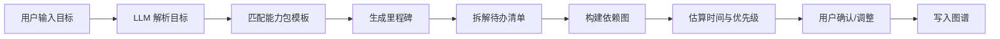
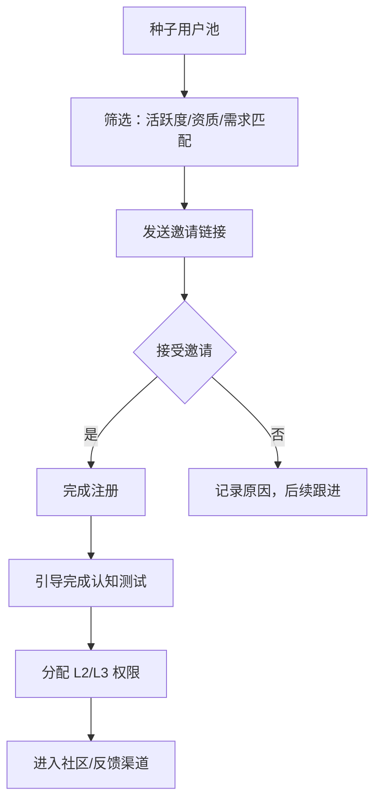
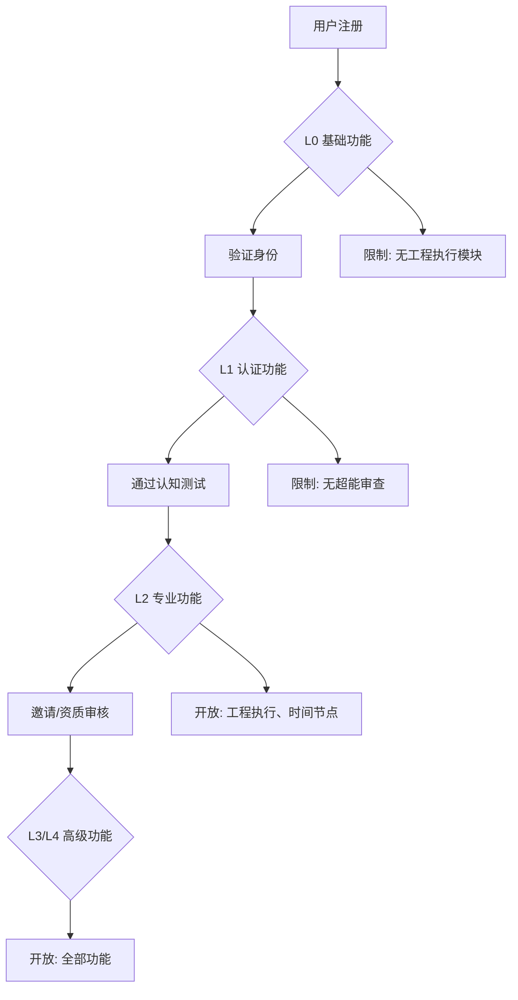

# 宇宙之心 v2.0 升级与商业化方案（审阅版）

> 目标：将 v1.7「个人自用 3D 知识图谱桌面工具」升级为 v2.0「商业化学习软件 + 多人协作白板」，并补齐注意力算法、专业学术模式、超能审查模式等能力。
> 审阅重点：产品定位、架构演进、合规边界、实施节奏、成本与风险。

---

## 1. 现状诊断：v1.7 能做什么、不能做什么

### 1.1 已具备能力

| 维度 | v1.7 现状 |
|---|---|
| 前端 | Next.js 14 + React 18 + TypeScript + TailwindCSS |
| 可视化 | `react-force-graph-3d` 3D 力导向图、嵌套子网络、多窗口 |
| 存储 | Dexie/IndexedDB 本地优先，无服务端持久化 |
| AI 调用 | 通过 `/api/chat` Edge Route 转发 DeepSeek/Kimi，用户自带 Key |
| 功能 | AI 生成节点、Zotero 式内容条、Agent 集群（单次调用模拟 5 专家）、认知训练闭环 |
| 视觉监督 | MediaPipe FaceMesh 本地推理，视线追踪、疲劳监测 |
| 打包 | Electron + electron-builder Windows 安装包 |

### 1.2 关键短板（商业化与扩张瓶颈）

1. **无后端**：无用户账号、无云同步、无协作、无权限、无计费。
2. **算法薄弱**：注意力/认知训练只有规则引擎（阅读时间、滚动覆盖、摘要长度），无自研模型。
3. **数据源单一**：依赖 LLM 生成和手动录入，未接入 OpenAlex、arXiv 等学术数据库。
4. **审查能力缺失**：无法对节点引用的证据、资源做可信度/造假/冲突检测。
5. **架构可扩展性差**：Zustand + localStorage 适合单机，不适合多人实时协作和大型项目。
6. **商业模式为零**：没有订阅、没有席位、没有机构授权、没有开源核心与商业插件的分层。

---

## 2. v2.0 产品定位与商业模式

### 2.1 一句话定位

> **宇宙之心 v2.0 = 面向深度学习与研究的 AI 协作白板 + 认知训练助手 + 学术证据审查工作台。**

### 2.2 目标用户分层

| 用户群 | 核心痛点 | 付费意愿 | 主要功能 |
|---|---|---|---|
| **学生 / 自学者** | 被动接受 AI、学完后记不住 | 中 | 认知训练、注意力监督、知识图谱 |
| **知识工作者 / 写作者** | 信息过载、资料可信度难判断 | 高 | 专业模式、超能审查、协作白板 |
| **科研人员** | 文献检索慢、引用网络复杂、造假难辨 | 高 | OpenAlex/arXiv、PDF 获取、证据审查 |
| **教育机构 / 企业培训** | 需要班级/团队管理、学习数据 | 高 | 机构授权、席位管理、管理后台 |

### 2.3 商业模式（推荐）

采用 **Open Core + SaaS + 机构授权** 三层模式：

- **免费版（Free）**
  - 本地单机使用，Dexie 存储，基础 3D 图谱，单次调用 Agent 集群。
  - 限制：每月 AI 调用次数、无云同步、无协作、无专业/超能模式。
- **Plus 订阅（个人）**
  - 云同步、跨设备、多人协作白板、专业模式、注意力监督基础版。
  - 按月/年订阅，赠送一定 AI Token。
- **Pro / 机构版**
  - 团队席位、SAML/SSO、管理后台、数据报表、超能审查、API 接入、私有化部署选项。
  - 按席位 + 用量计费。
- **开源核心**
  - 图谱渲染、本地存储、基础 AI 代理可开源（建议 AGPL），吸引开发者与教育机构；商业功能闭源。

### 2.4 计费与支付

| 计费项 | 说明 |
|---|---|
| 订阅费 | Stripe / Paddle（国际）；支付宝/微信支付（国内） |
| AI 用量包 | 按 Token 或按调用次数计费，超额购买 |
| 机构席位 | 按人头/年付费，含管理后台 |
| 私有化部署 | 一次性授权费 + 年度维护费 |

> **建议**：早期用 Paddle 统一处理全球支付与税务，降低合规成本；国内如需合规，再接入微信支付/支付宝并做 ICP 备案。

---

## 3. 总体架构升级方案

### 3.1 目标架构

```text
┌─────────────────────────────────────────────────────────────┐
│                        客户端层                              │
│  Electron 桌面端  │  Web 端  │  未来移动端/PWA               │
│  (保留并重构)     │ (新增)   │                              │
└──────────────┬──────────────────────────────────────────────┘
               │  HTTPS / WebSocket
┌──────────────▼──────────────────────────────────────────────┐
│                      接入与网关层                            │
│  CDN + WAF + API Gateway + 实时协作网关 (Socket.io/WebSocket) │
└──────────────┬──────────────────────────────────────────────┘
               │
┌──────────────▼──────────────────────────────────────────────┐
│                      应用服务层                              │
│  账户服务 │ 项目服务 │ 协作服务 │ 计费服务 │ AI 编排服务      │
│  注意力服务 │ 专业模式服务 │ 超能审查服务 │ 通知服务         │
└──────────────┬──────────────────────────────────────────────┘
               │
┌──────────────▼──────────────────────────────────────────────┐
│                        数据层                                │
│  PostgreSQL (主库) │ Redis (缓存/实时状态) │ S3/MinIO (文件) │
│  ClickHouse/Postgres (行为分析) │ 向量数据库 (PGVector)       │
└──────────────┬──────────────────────────────────────────────┘
               │
┌──────────────▼──────────────────────────────────────────────┐
│                     AI / 算法 / 外部数据层                   │
│  LLM 路由 │ 注意力算法 │ 视觉监督 (本地) │ OpenAlex/arXiv   │
│  学术反造假工具 │ PDF 解析 │ 向量 Embedding                  │
└─────────────────────────────────────────────────────────────┘
```

### 3.2 技术栈建议

| 层级 | 推荐方案 | 理由 |
|---|---|---|
| 客户端 | 保留 Next.js + React + TypeScript + Tailwind | 现有团队熟悉，Web/桌面共用代码 |
| 3D 图谱 | 继续 `react-force-graph-3d` 或逐步迁移至 `@react-three/fiber` | 控制渲染性能、支持更多协作交互 |
| 桌面端 | 保留 Electron，但拆分主进程职责 | 已有的打包与窗口管理经验 |
| 后端框架 | **NestJS (Node.js)** 或 **FastAPI (Python)** | NestJS 适合复杂业务、权限、计费；FastAPI 适合算法/AI 服务。可采用 Node 主服务 + Python 算法微服务 |
| 数据库 | PostgreSQL 16 + Redis 7 | 关系型数据 + 实时状态/锁 |
| 实时协作 | **Yjs (CRDT)** 或 Socket.io + Operational Transform | Yjs 更适合白板/文档类协作 |
| 对象存储 | S3 / MinIO / 阿里云 OSS | PDF、附件、快照 |
| 向量检索 | PGVector 或 Milvus | 语义搜索、相似文献 |
| 任务队列 | BullMQ (Redis) 或 Celery | AI 任务、PDF 解析、审查任务 |
| 日志/监控 | OpenTelemetry + Sentry + Grafana | 商业化后的可观测性 |

### 3.3 5000人规模服务器架构设计

> **目标**：支持 5000 名注册用户，其中 1000 人同时在线，100 人实时协作。

#### 架构拓扑

```text
┌────────────────────────────────────────────────────────────────────────┐
│                         边缘层 (CDN/WAF)                              │
│  Cloudflare/Akamai + Cloudflare WAF + Rate Limiting                    │
└──────────────────────────────┬─────────────────────────────────────────┘
                               │
┌──────────────────────────────▼─────────────────────────────────────────┐
│                        负载均衡层                                     │
│  Nginx / AWS ALB / 阿里云 SLB                                         │
│  → 健康检查 → 会话保持 → 流量分发                                      │
└──────────────────────────────┬─────────────────────────────────────────┘
                               │
┌──────────────────────────────▼─────────────────────────────────────────┐
│                      应用服务层 (容器化)                               │
│  ┌──────────────┬──────────────┬──────────────┐                      │
│  │  API Gateway │  API Gateway │  API Gateway │  × 3 (水平扩展)        │
│  └──────────────┴──────────────┴──────────────┘                      │
│  ┌──────────────┬──────────────┬──────────────┐                      │
│  │   NestJS     │   NestJS     │   NestJS     │  × 5 (业务逻辑)       │
│  │   主服务     │   主服务     │   主服务     │                      │
│  └──────────────┴──────────────┴──────────────┘                      │
│  ┌──────────────┬──────────────┬──────────────┐                      │
│  │   FastAPI    │   FastAPI    │   FastAPI    │  × 3 (算法服务)       │
│  │   算法服务   │   算法服务   │   算法服务   │                      │
│  └──────────────┴──────────────┴──────────────┘                      │
│  ┌──────────────┬──────────────┬──────────────┐                      │
│  │   Yjs        │   Yjs        │   Yjs        │  × 3 (实时协作)       │
│  │   协作网关   │   协作网关   │   协作网关   │                      │
│  └──────────────┴──────────────┴──────────────┘                      │
│  ┌──────────────┬──────────────┬──────────────┐                      │
│  │   BullMQ     │   BullMQ     │   BullMQ     │  × 2 (任务队列)       │
│  │   Worker     │   Worker     │   Worker     │                      │
│  └──────────────┴──────────────┴──────────────┘                      │
└──────────────────────────────┬─────────────────────────────────────────┘
                               │
┌──────────────────────────────▼─────────────────────────────────────────┐
│                        数据层                                         │
│  ┌──────────────────┐  ┌──────────────────┐  ┌──────────────────┐    │
│  │ PostgreSQL 主从  │  │   Redis Cluster  │  │    MinIO/S3      │    │
│  │  (主+2从+只读)   │  │  (3主3从)        │  │  (多区域备份)     │    │
│  └──────────────────┘  └──────────────────┘  └──────────────────┘    │
│  ┌──────────────────┐  ┌──────────────────┐                          │
│  │   PGVector      │  │   ClickHouse     │                          │
│  │  (向量检索)      │  │  (行为分析)       │                          │
│  └──────────────────┘  └──────────────────┘                          │
└──────────────────────────────┬─────────────────────────────────────────┘
                               │
┌──────────────────────────────▼─────────────────────────────────────────┐
│                        监控与运维层                                   │
│  Prometheus + Grafana + Loki + Sentry + OpenTelemetry                 │
│  → 告警 → 日志追踪 → 性能分析 → 错误监控                               │
└────────────────────────────────────────────────────────────────────────┘
```

#### 服务器配置预估

| 服务 | 实例数 | 单实例配置 | 用途 |
|---|---|---|---|
| API Gateway | 3 | 2核/4G | 入口路由、限流、认证 |
| NestJS 主服务 | 5 | 4核/8G | 业务逻辑、数据库操作 |
| FastAPI 算法服务 | 3 | 8核/16G | AI 编排、算法计算 |
| Yjs 协作网关 | 3 | 4核/8G | 实时协作、CRDT 同步 |
| BullMQ Worker | 2 | 4核/8G | 异步任务处理 |
| PostgreSQL | 1主+2从 | 8核/32G | 主数据库 |
| Redis Cluster | 6节点 | 4核/16G | 缓存、实时状态 |
| MinIO/S3 | 4节点 | 4核/8G+大容量存储 | 对象存储 |
| PGVector | 2节点 | 8核/32G | 向量检索 |
| ClickHouse | 2节点 | 8核/32G | 行为分析 |

#### 网络与安全

| 组件 | 说明 |
|---|---|
| VPC | 私有网络隔离，分公网/内网子网 |
| 安全组 | 端口白名单，只开放必要端口 |
| WAF | 防护 SQL 注入、XSS、CSRF |
| DDoS 防护 | 流量清洗、速率限制 |
| SSL/TLS | 全站 HTTPS，证书自动续期 |

#### 高可用设计

- **数据库**：主从复制 + 自动故障切换
- **缓存**：Redis Cluster 集群，数据分片
- **服务**：容器编排 (K8s/ECS)，自动扩缩容
- **存储**：对象存储多区域备份
- **网络**：多可用区部署，故障自动转移

#### 成本估算（5000人规模）

| 项目 | 预估月成本 |
|---|---|
| 云服务器 (18+ 实例) | ¥8,000–15,000 |
| 数据库服务 | ¥3,000–6,000 |
| 对象存储 + CDN | ¥1,000–3,000 |
| LLM API 用量 | ¥5,000–15,000 |
| 监控/日志/安全 | ¥1,000–2,000 |
| **合计** | **¥18,000–41,000/月** |

### 3.4 公版 vs 私版方案

| 维度 | 公版 (SaaS) | 私版 (私有化部署) |
|---|---|---|
| **部署方式** | 公有云多租户 | 客户自有环境 |
| **数据主权** | 平台托管 | 客户完全控制 |
| **定制化** | 有限配置 | 深度定制开发 |
| **升级节奏** | 统一推送 | 客户自主选择 |
| **运维责任** | 平台负责 | 客户负责 |
| **合规边界** | 平台承担 | 客户承担 |
| **定价模式** | 订阅制 | 授权费 + 维护费 |

#### 公版目标用户

- 学生、自学者、小型团队
- 对数据主权要求不高的用户
- 希望快速上手、无需运维

#### 私版目标用户

- 科研机构、企业团队
- 对数据安全有严格要求
- 需要深度定制功能
- 需要与现有系统集成

#### 功能差异

| 功能 | 公版 | 私版 |
|---|---|---|
| 基础图谱 | ✓ | ✓ |
| AI 编排 | ✓ | ✓ |
| 学术模式 | ✓ | ✓ |
| 超能审查 | L3+ 限制 | 全部开放 |
| 工程执行模块 | L2+ 限制 | 全部开放 |
| 团队协作 | 最多 10 人 | 不限 |
| SSO/SAML | × | ✓ |
| 私有化存储 | × | ✓ |
| 定制开发 | × | ✓ |
| API 接入 | 有限 | 完整 |

### 3.5 数据模型迁移

- 将 `Project`、`GraphNode`、`GraphLink`、`ContentItem`、`Attachment` 从 IndexedDB 迁移到 PostgreSQL。
- 保留本地离线缓存（Dexie / SQLite）用于无网络时使用，在线后通过同步协议合并。
- 引入 `Workspace`（工作区）、`User`、`Role`、`Permission`、`BillingSubscription` 等新实体。
- 附件从浏览器 object URL 迁移到 S3 预签名 URL。

---

## 4. 多人协作架构设计（新增）

### 4.1 实时协作白板

#### 技术选型

采用 **Yjs + y-websocket** 做操作层 CRDT，支持多人同时拖拽节点、编辑内容条目、创建关系。

#### 核心架构

```text
┌─────────────────────────────────────────────────────────────┐
│                    客户端协作层                              │
│  ┌──────────┐  ┌──────────┐  ┌──────────┐                  │
│  │  用户A   │  │  用户B   │  │  用户C   │  ...              │
│  │ Yjs文档  │  │ Yjs文档  │  │ Yjs文档  │                  │
│  └────┬─────┘  └────┬─────┘  └────┬─────┘                  │
│       │             │             │                         │
└───────┼─────────────┼─────────────┼─────────────────────────┘
        │             │             │
        ▼             ▼             ▼
┌─────────────────────────────────────────────────────────────┐
│                    Yjs 协作网关层                            │
│  ┌─────────────────────────────────────────────────────┐    │
│  │  y-websocket-server + 房间管理 + 权限校验           │    │
│  │  → 操作转发 → 状态同步 → 持久化                      │    │
│  └─────────────────────────────────────────────────────┘    │
└──────────────────────────────┬──────────────────────────────┘
                               │
                               ▼
┌─────────────────────────────────────────────────────────────┐
│                    持久化层                                  │
│  PostgreSQL (图结构) + Redis (实时状态) + S3 (附件)          │
└─────────────────────────────────────────────────────────────┘
```

#### 状态同步粒度

| 操作类型 | 同步策略 | 频率 |
|---|---|---|
| 节点坐标 | CRDT 实时同步 | 高频（每帧） |
| 图结构变更 | 事务化 + 版本号 | 中频 |
| 内容条目编辑 | Operational Transform | 低频 |
| 用户 Presence | Redis 发布订阅 | 实时 |

#### 核心功能

| 功能 | 说明 | 实现方式 |
|---|---|---|
| **在线用户头像/光标** | 实时显示其他用户位置 | Yjs Presence + 自定义光标组件 |
| **节点锁定** | 防止多人同时编辑冲突 | Yjs 事务锁 + 视觉提示 |
| **评论与批注** | 在节点/内容上添加评论 | 独立评论模型 + 实时同步 |
| **版本历史与回滚** | 查看历史版本并恢复 | Yjs 快照 + 时间线 |
| **演示模式** | 跟随主持人视角 | 强制视图同步 + 权限控制 |
| **分支/合并** | 类似 Git 的轻量分支 | Yjs 子文档 + 合并算法 |

#### 冲突解决策略

```typescript
// CRDT 冲突解决示例
interface CollaborativeOperation {
  userId: string;
  timestamp: number;
  operation: 'create' | 'update' | 'delete';
  targetId: string;
  data: unknown;
  version: number;
}

// 乐观冲突解决：以最后操作为准
function resolveConflict(
  localOp: CollaborativeOperation,
  remoteOp: CollaborativeOperation
): CollaborativeOperation {
  return localOp.timestamp > remoteOp.timestamp ? localOp : remoteOp;
}
```

### 4.2 用户系统设计

#### 用户实体模型

```typescript
interface User {
  id: string;
  email: string;
  username: string;
  avatarUrl?: string;
  role: 'free' | 'plus' | 'pro' | 'enterprise';
  createdAt: Date;
  lastActiveAt: Date;
  settings: UserSettings;
}

interface UserSettings {
  theme: 'light' | 'dark' | 'system';
  language: string;
  visualSupervisionEnabled: boolean;
  notificationPreferences: NotificationPreferences;
}
```

#### 认证方式

| 方式 | 适用场景 | 实现 |
|---|---|---|
| 邮箱 + 密码 | 基础认证 | Passport.js + JWT |
| Magic Link | 无密码登录 | 一次性链接 + 时效验证 |
| Google/GitHub OAuth | 第三方登录 | Passport OAuth2 |
| 微信登录 | 国内用户 | 微信开放平台 |
| SAML 2.0 / OIDC | 企业 SSO | NestJS Passport |

### 4.3 权限模型（RBAC + ABAC）

#### 角色定义

| 角色 | 权限范围 | 适用场景 |
|---|---|---|
| **Owner** | 全部权限、转移所有权、删除工作区 | 工作区创建者 |
| **Admin** | 成员管理、计费、导出 | 团队管理员 |
| **Editor** | 编辑图谱、上传附件、邀请评论者 | 核心协作成员 |
| **Commenter** | 仅评论与批注 | 外部顾问、观察者 |
| **Viewer** | 只读访问 | 项目访客 |

#### 权限矩阵

```typescript
interface Permission {
  resource: 'workspace' | 'project' | 'node' | 'link' | 'attachment';
  action: 'read' | 'write' | 'delete' | 'admin';
  scope: 'global' | 'workspace' | 'project';
  condition?: (context: PermissionContext) => boolean;
}

// 示例：Editor 角色权限
const EditorPermissions: Permission[] = [
  { resource: 'node', action: 'read', scope: 'workspace' },
  { resource: 'node', action: 'write', scope: 'workspace' },
  { resource: 'link', action: 'read', scope: 'workspace' },
  { resource: 'link', action: 'write', scope: 'workspace' },
  { resource: 'attachment', action: 'read', scope: 'workspace' },
  { resource: 'attachment', action: 'write', scope: 'workspace' },
];
```

### 4.4 数据同步方案

#### 离线优先策略

```text
┌─────────────────────────────────────────────────────────────────┐
│                    客户端数据层                                  │
│  ┌──────────────────┐                                          │
│  │   Dexie 本地库   │ ←── 离线操作缓存                          │
│  └────────┬─────────┘                                          │
│           │ 同步触发                                           │
│           ▼                                                    │
│  ┌──────────────────┐                                          │
│  │   同步管理器     │ ←── 冲突检测 + 版本合并                   │
│  └────────┬─────────┘                                          │
└───────────┼────────────────────────────────────────────────────┘
            │ 网络请求
            ▼
┌─────────────────────────────────────────────────────────────────┐
│                    服务端同步层                                  │
│  ┌──────────────────┐  ┌──────────────────┐                    │
│  │  增量同步接口    │  │  冲突解决服务    │                    │
│  │  /api/sync/pull  │  │  ConflictResolver│                    │
│  │  /api/sync/push  │  └──────────────────┘                    │
│  └──────────────────┘                                          │
└─────────────────────────────────────────────────────────────────┘
```

#### 同步协议

```typescript
interface SyncRequest {
  workspaceId: string;
  lastSyncVersion: number;
  operations: SyncOperation[];
}

interface SyncOperation {
  id: string;
  type: 'create' | 'update' | 'delete';
  entityType: 'node' | 'link' | 'content' | 'attachment';
  entityId: string;
  data?: unknown;
  timestamp: number;
  version: number;
}

interface SyncResponse {
  newVersion: number;
  operations: SyncOperation[];  // 服务端变更
  conflicts: Conflict[];        // 需要手动解决的冲突
}
```

---

## 5. 账号、安全与商业化能力

### 5.1 账号体系

- 邮箱 + 密码、Magic Link、Google/GitHub OAuth、微信登录（国内）。
- 机构版支持 **SAML 2.0 / OIDC SSO**。
- 多因素认证（MFA）。
- 未成年人模式：年龄验证、使用时长限制、数据隔离、家长/机构授权。

### 5.2 权限模型

| 角色 | 权限 |
|---|---|
| Owner | 全部权限、转移所有权、删除工作区 |
| Admin | 成员管理、计费、导出 |
| Editor | 编辑图谱、上传附件、邀请评论者 |
| Commenter | 仅评论与批注 |
| Viewer | 只读访问 |

### 5.3 安全与合规

- 传输层 TLS 1.3，数据库加密。
- 敏感笔记支持 **端到端加密（E2EE）** 选项，服务端无法解密。
- 行为数据本地优先，上传仅脱敏聚合统计（默认关闭）。
- 合规：GDPR（欧盟）、CCPA（加州）、PIPL（中国个人信息保护法）、未成年人保护法。
- **明确声明：本产品不是医疗器械，不提供诊断或治疗建议。**

---

## 6. 注意力算法与视觉监督

> v1.7 已有基础规则引擎。v2.0 需要升级为**多模态注意力评估系统**，并新增可选的视觉监督模块。

### 6.1 设计原则

- **本地优先**：原始行为序列与原始视频帧不上传。
- **可解释**：每个干预都给出原因。
- **可配置**：用户可选择监督强度或完全关闭。
- **非惩罚性**：温和提醒为主，允许申诉/跳过。

### 6.2 信号采集层

| 信号 | 采集方式 | 隐私等级 | 用途 |
|---|---|---|---|
| 鼠标轨迹/点击/滚动 | DOM 事件 | 低 | 阅读覆盖、交互密度、点击热区 |
| 键盘输入节奏 | 事件监听 | 低 | 停顿、复制粘贴检测 |
| 窗口焦点 / Tab 可见性 | Page Visibility API | 低 | 挂机/分心检测 |
| 应用内停留时长 | 时间戳 | 低 | 深度工作时长 |
| 节点操作序列 | 应用状态 | 低 | 主动思考 vs 被动接受 |
| 自写摘要 | 用户输入 | 低 | 认知训练质量 |
| 摄像头（可选） | WebRTC + MediaPipe/WebGazer | **高** | 视线落点、疲劳、头部姿态 |
| 麦克风（可选，未来） | Web Speech API | 中 | 语音摘要、流利度 |

> **摄像头模块**：必须在本地完成全部推理（ONNX/TensorFlow.js/MediaPipe），不向服务端传输原始视频；开启前需二次确认；界面常驻指示灯；可随时关闭。

### 6.3 注意力评估指标

```text
注意力得分 = 0.25 × 阅读覆盖度
          + 0.25 × 有效停留时间 / 期望阅读时间
          + 0.20 × 交互密度（去噪后）
          + 0.15 × 摘要质量
          + 0.10 × 手动节点比例
          + 0.05 × 视觉焦点得分（摄像头开启时）
```

各指标说明：

- **阅读覆盖度**：用户在 AI 输出/内容面板的滚动覆盖比例。
- **期望阅读时间**：按文本长度 / 个人阅读速度动态计算。
- **交互密度**：点击、滚动、选中文本、节点编辑的加权频率，过滤无意义抖动。
- **摘要质量**：长度、关键词覆盖、原创性、结构信号。
- **手动节点比例**：用户自建节点数 / AI 生成节点数。
- **视觉焦点得分**（可选）：通过摄像头估计视线是否落在内容区域、眨眼频率是否异常、头部姿态是否偏离。

### 6.4 干预策略

注意：必须要隐形，不能直接中断用户操作。要做到几乎没有监视感，每次结束后或者用户中途必须要检查状态，确认是否需要干预。

| 检测场景 | 干预方式 | 强度 |
|---|---|---|
| 阅读时间不足 | 禁用「应用 AI 输出」按钮，提示剩余时间 | 强 |
| 滚动覆盖低 | 提示「请继续浏览内容」 | 轻 |
| 长时间离开窗口 | 右下角温和提醒，暂停计时 | 轻 |
| 复制粘贴摘要 | 提示用自己的话总结 | 中 |
| 视觉焦点持续偏离（摄像头） | 弹出「需要休息吗？」 | 轻 |
| 疲劳 detected | 建议番茄休息 | 轻 |
| 连续快速通过训练 | 自动提高训练强度 | 自适应 |

### 6.5 个性化校准

- 第 1 周采集基线（不干预）。
- 用户完成 5–10 次自我报告（太简单/刚好/太难）。
- 在线更新个人阈值（阅读速度、摘要长度期望、疲劳阈值）。
- 可选使用本地轻量模型（transformers.js 或 sklearn.js）做阈值微调。

---

## 7. 专业模式：学术数据库与文献获取

### 7.1 目标

让科研人员和学生能够快速从公开学术数据库检索文献、导入引用网络、获取可阅读 PDF，并自动生成知识图谱节点。

### 7.2 数据源集成

| 数据源 | 用途 | 接入方式 |
|---|---|---|
| **OpenAlex** | 论文、作者、机构、引用关系 | REST API |
| **arXiv** | 预印本、PDF 直链 | arXiv API |
| **Crossref** | DOI 元数据、参考文献 | REST API |
| **Semantic Scholar** | 引用上下文、TL;DR、影响力 | REST API |
| **Unpaywall** | 合法开放获取 PDF 链接 | REST API |
| **PubMed / Europe PMC** | 生物医学文献 | E-utilities API |
| **OpenAlex 概念层级** | 学科分类、研究前沿 | 实体快照 |

### 7.3 核心功能

1. **文献搜索面板**
   - 按关键词、作者、DOI、标题、概念领域搜索。
   - 结果列表显示标题、摘要、发表年份、引用量、开放获取状态。
   - 一键「导入为节点」，自动创建 `paper` / `principle` / `evidence` 节点。

2. **引用图谱导入**
   - 以某篇论文为中心，导入前向/后向引用 N 层。
   - 自动生成引用关系连线，颜色按年份或主题区分。

3. **PDF 快速获取**
   - 优先从 **Unpaywall / OA 出版社 / arXiv** 获取合法 PDF。
   - 支持用户绑定机构图书馆代理，自动跳转机构订阅。
   - 支持用户手动上传 PDF，解析元数据并建立全文索引。
   - **影子图书馆聚合**：在合规前提下，提供 DOI 解析助手，聚合公开可访问的镜像（如 Anna's Archive、Library Genesis、Sci-Hub）。
     - **重要合规声明**：此类来源的法律地位因国家/地区而异，必须明确告知用户仅用于个人学习、不得传播，默认开启。

4. **PDF 内容解析**
   - 提取标题、作者、摘要、关键词、参考文献（GROBID / pdfplumber / Marker）。
   - 全文 OCR（可选，用于扫描版 PDF）。
   - 生成内容条目（abstract、excerpt、evidence）。
   - 段落级语义嵌入，支持「这篇论文支持/反驳哪个观点」。

5. **与个人图谱联动**
   - 将论文节点与概念节点自动连线。
   - 在写摘要时自动推荐相关论文段落。

---

## 8. 超能模式：证据与资源实时审查

### 8.1 目标

对用户添加到图谱中的**证据、资源、声明**进行实时可信度评估，识别潜在错误、偏见、造假和低质量来源。

### 8.2 审查维度

| 维度 | 说明 | 工具/数据来源 |
|---|---|---|
| **来源可信度** | 期刊级别、出版社声誉、域名年龄 | DOAJ、Beall's List、Think.Check.Submit、NewsGuard |
| **撤稿与质疑** | 论文是否被撤稿或有大量 PubPeer 评论 | Retraction Watch、PubPeer API |
| **图像造假** | 图片拼接、复制、过度处理 | ImageTwin、ImageJ / DeelFake 检测（本地） |
| **统计问题** | p-hacking、错误报告、不一致统计 | statcheck、GRIM/SPRITE 测试 |
| **引用质量** | 参考文献是否存在、是否被 retracted、引用上下文 | Crossref、OpenAlex、Retraction Watch |
| **事实核查** | 声明是否与权威来源一致 | LLM + 维基百科/官方数据库交叉验证 |
| **偏见与立场** | 媒体偏见、资助来源、利益冲突 | Media Bias/Fact Check、机构资助数据库 |
| **链接健康** | 来源链接是否失效、是否被篡改 | 链接轮询 + Wayback Machine |

### 8.3 实现方式

- **实时审查**：用户粘贴 URL/DOI/PDF 时，后台触发审查任务队列，数秒内返回初步徽章。
- **深度审查**：用户点击「深度审查」后，后台调用多个工具并聚合生成结构化报告。
- **LLM 聚合判断**：用结构化输出模型生成最终结论：
  - `supported`（证据充分）
  - `contradicted`（存在矛盾/撤稿）
  - `questionable`（需要人工复核）
  - `unverifiable`（无法验证）
- **可视化**：节点/附件上显示彩色徽章（🟢 可信 / 🟡 待核 / 🔴 存疑 / ⚪ 未验证）。

### 8.4 开源学术与反造假工具清单（建议集成）

- **文献元数据**：OpenAlex SDK、habanero (Crossref)、arxiv.py
- **PDF 解析**：GROBID、Marker、pdfplumber、PyMuPDF
- **统计审查**：statcheck (R/Python)、GRIM/SPRITE
- **图像审查**：ImageTwin API、FotoForensics（部分免费）、本地 CNN 异常检测
- **撤稿/质疑**：Retraction Watch Database、PubPeer API
- **事实核查**：Google Fact Check Tools API、Wikidata
- **链接存档**：Wayback Machine API

---

## 9. AI 编排与 API 转接

### 9.1 从「直接转发」到「AI 编排层」

v1.7 中 `/api/chat` 只是简单转发用户 API Key。v2.0 需要：

- **统一 LLM 路由**：根据模型能力、成本、用户套餐选择模型。
- **提示词管理**：版本化、A/B 测试、模板库。
- **工具调用（Function Calling）**：让 LLM 调用数据库、搜索、PDF 解析、审查工具。
- **流式输出**：改善 ChatPanel 体验。
- **成本配额**：按用户/团队限制 Token 用量，超额提示购买。

### 9.2 推荐模型分层

| 任务 | 模型 | 理由 |
|---|---|---|
| 通用对话/节点生成 | DeepSeek-V3 / Kimi / GPT-4o-mini | 成本低、中文好 |
| 复杂推理/Agent 集群 | DeepSeek-R1 / o3-mini / Claude 3.5 Sonnet | 推理能力强 |
| 结构化 JSON / 审查输出 | GPT-4o / Claude 3.5 Haiku | 稳定 |
| 本地隐私任务 | Llama 3.1 8B (Ollama/llama.cpp) | 不上云 |

### 9.3 API Key 策略

- 免费版：可使用平台赠送的共享额度，或仍允许用户填自己的 Key。
- Plus/机构版：由平台统一计费，用户无需自行申请 Key。

---

## 10. 实施路线图

### Phase 0：基础重构（2–3 个月）

- [ ] 后端服务搭建（NestJS/FastAPI + PostgreSQL + Redis）
- [ ] 用户账号、登录、OAuth、MFA
- [ ] 项目/工作区数据模型迁移
- [ ] 云同步与离线缓存协议
- [ ] 客户端架构重构：拆分状态层、服务层、离线层
- [ ] CI/CD、测试框架、监控

### Phase 1：协作白板（2–3 个月）

- [ ] Yjs 实时协作接入
- [ ] 在线光标、Presence、节点锁定
- [ ] 权限系统、邀请链接、角色管理
- [ ] 版本历史、回滚、评论批注
- [ ] 演示模式与多视图协作

### Phase 2：商业化（2 个月）

- [ ] 订阅计划与计费系统
- [ ] Stripe/Paddle/微信支付接入
- [ ] AI Token 配额与用量统计
- [ ] 机构席位、SAML、管理后台
- [ ] 开源核心拆分与 License

### Phase 3：注意力与视觉监督（2–3 个月）

- [ ] 行为采集 SDK（鼠标、键盘、滚动、焦点）
- [ ] 注意力评分规则引擎升级
- [ ] 认知训练强度模板与自适应阈值
- [ ] 摄像头视觉监督模块（本地推理，可选）
- [ ] 注意力仪表盘与周报告

### Phase 4：专业模式（2–3 个月）

- [ ] OpenAlex / arXiv / Crossref 搜索面板
- [ ] 引用图谱导入
- [ ] PDF 获取助手（合法 OA + 机构代理）
- [ ] PDF 解析与全文索引
- [ ] 文献节点与个人图谱联动

### Phase 5：超能模式（2–3 个月）

- [ ] 来源可信度评分
- [ ] 撤稿/质疑检测
- [ ] 图像/统计造假检测集成
- [ ] 事实核查与 LLM 聚合判断
- [ ] 审查徽章与报告导出

### Phase 5.5：工程执行模块（2 个月，v2.5）

> 单人 OPC 核心需求：AI 自动生成时间节点与待办清单，无需多人协作即可完成复杂项目。

#### 核心功能

| 功能 | 说明 | AI 工具链 |
|---|---|---|
| **时间节点自动生成** | 根据项目目标、能力包模板，自动拆解为里程碑+检查点 | LLM + 模板引擎 |
| **智能待办清单** | 每日/每周自动生成任务，根据进度动态调整 | LangGraph 状态机 |
| **依赖关系可视化** | 任务间前置依赖、阻塞项自动识别 | DAG 渲染 |
| **执行追踪面板** | 实时显示进度、风险、阻塞、下一步 | Dashboard 组件 |
| **失败回溯引擎** | 任务失败时自动定位断裂节点，生成修复建议 | 证据链分析 |

#### 数据模型扩展

```typescript
// 新增节点类型
type NodeType = ... | 'action-guide'  // 行动指南

// 行动指南节点结构
interface ActionGuideNode extends GraphNode {
  type: 'action-guide'
  data: {
    // 时间线
    milestones: Milestone[]
    // 待办清单
    todos: Todo[]
    // 依赖图
    dependencies: Dependency[]
    // 执行状态
    status: 'draft' | 'running' | 'blocked' | 'completed' | 'failed'
    // 关联证据
    evidenceIds: string[]
  }
}

interface Milestone {
  id: string
  title: string
  dueDate: Date
  status: 'pending' | 'in_progress' | 'completed' | 'overdue'
  checkpoints: Checkpoint[]
}

interface Todo {
  id: string
  title: string
  description: string
  priority: 'high' | 'medium' | 'low'
  estimatedHours: number
  actualHours?: number
  status: 'todo' | 'doing' | 'done' | 'blocked'
  blockedReason?: string
  dependsOn: string[]  // Todo IDs
  milestoneId: string
}

interface Dependency {
  from: string  // Todo ID
  to: string    // Todo ID
  type: 'finish_to_start' | 'start_to_start' | 'finish_to_finish'
}
```

#### AI 生成流程



#### 界面设计

```
┌─────────────────────────────────────────────────────────────┐
│ 工程执行面板                                                │
├─────────────────────────────────────────────────────────────┤
│ ┌─ 时间线视图 ─────────────────────────────────────────────┐│
│ │ M1: 原理验证 ──► M2: 最小实验 ──► M3: 原型 ──► M4: 交付  ││
│ │    ✓ 完成          🔄 进行中        ⏸ 待开始      ⏸ 待开始││
│ └──────────────────────────────────────────────────────────┘│
│ ┌─ 今日待办 ───────────────────────────────────────────────┐│
│ │ □ 完成数据清洗 (预计 2h, 高优先)                          ││
│ │ □ 编写测试用例 (预计 1.5h, 中优先)                        ││
│ │ ⚠ 被阻塞: 等待 API Key (阻塞原因: 审批中)                 ││
│ └──────────────────────────────────────────────────────────┘│
│ ┌─ 风险提示 ───────────────────────────────────────────────┐│
│ │ ⚠ M2 延迟风险: 数据质量未达标，建议增加预处理步骤         ││
│ └──────────────────────────────────────────────────────────┘│
└─────────────────────────────────────────────────────────────┘
```

### Phase 6：打磨与增长（持续）

- [ ] 性能优化（大规模图谱 > 5000 节点）
- [ ] 移动端/PWA
- [ ] 社区模板市场
- [ ] 教育/科研试点

---

## 11. 成本与团队估算

### 11.1 团队规模（当前：单人 OPC）

| 角色 | 人数 | 说明 |
|---|---|---|
| **OPC（一人多角色）** | 1 | 全栈开发 + 产品 + 算法 + 运维 |

> 当前阶段由单人 OPC 主导开发，利用现有 AI 工具链最大化效率。随着 MVP 验证后再考虑扩编。

### 11.2 AI 工具链清单（OPC 高效开发）

> 单人开发充分利用现成开源/商业工具，避免重复造轮子。

#### 视觉与感知
| 任务 | 推荐工具 | 说明 |
|---|---|---|
| 目标检测/视觉监督 | **YOLO (Ultralytics)** | 视线检测、疲劳检测、头部姿态 |
| 人脸/表情识别 | **MediaPipe Face Mesh** | 注意力相关情绪感知 |
| 手势/视线追踪 | **MediaPipe Hands/Eye Tracking** | 交互分析 |
| 图像异常检测 | **CLIP / SigLIP** | 图像内容理解 |
| OCR | **PaddleOCR / EasyOCR** | PDF/截图文字提取 |

#### 注意力与认知
| 任务 | 推荐工具 | 说明 |
|---|---|---|
| 注意力评估 | **transformers.js + 本地模型** | 本地推理隐私优先 |
| 认知训练 | **LangChain / LangGraph** | Agent 流程编排 |
| 疲劳检测 | **MediaPipe BlazeFace** | 眨眼频率、头部下垂 |
| 阅读行为分析 | **WebGazer.js** | 视线落点分析 |

#### 学术与文献
| 任务 | 推荐工具 | 说明 |
|---|---|---|
| 文献检索 | **OpenAlex API** | 免费开源学术图谱 |
| PDF 解析 | **Marker / GROBID** | 论文结构化提取 |
| 论文元数据 | **habanero (Crossref)** | DOI/引用数据 |
| arXiv 集成 | **arxiv.py** | 预印本获取 |
| 摘要生成 | **LLM API (DeepSeek/Kimi)** | 配合本地向量检索 |

#### LLM 与推理
| 任务 | 推荐工具 | 说明 |
|---|---|---|
| 模型调用 | **Ollama / llama.cpp** | 本地 7B–70B 模型 |
| 云端 LLM | **DeepSeek-V3 / Kimi / GPT-4o-mini** | 通用对话 |
| 复杂推理 | **DeepSeek-R1 / o3-mini** | Agent 集群 |
| 结构化输出 | **GPT-4o / Claude 3.5 Haiku** | JSON 审查结果 |
| Embedding | **text-embedding-3-small / BGE** | 向量化存储 |

#### 工程与部署
| 任务 | 推荐工具 | 说明 |
|---|---|---|
| 后端框架 | **FastAPI** | Python 算法服务，简洁高效 |
| 状态管理 | **Zustand + Dexie** | 现有方案保留 |
| 实时协作 | **Yjs + y-websocket** | CRDT 协作 |
| 数据库 | **PostgreSQL + Redis** | 关系型 + 缓存 |
| 向量检索 | **PGVector / Qdrant** | 语义搜索 |
| 任务队列 | **BullMQ** | AI 任务调度 |
| 容器化 | **Docker + Docker Compose** | 本地开发与部署 |
| CI/CD | **GitHub Actions** | 自动化构建 |

#### 审查与安全
| 任务 | 推荐工具 | 说明 |
|---|---|---|
| 撤稿检测 | **Retraction Watch API** | 论文可信度 |
| 图像伪造检测 | **ImageTwin API /本地 CNN** | 证据审查 |
| 统计审查 | **statcheck** | p-hacking 检测 |
| 事实核查 | **Google Fact Check API** | 声明验证 |
| 链接存档 | **Wayback Machine API** | 资源健康检查 |

### 11.3 邀请制团队配置建议

> **邀请制策略**：优先邀请能够提供真实价值、遵守规则、并能帮助产品成长的用户。

#### 首批邀请对象（种子用户）

| 用户类型 | 特点 | 邀请渠道 | 预期贡献 |
|---|---|---|---|
| **科研人员** | 有真实研究需求，重视证据链 | 学术论坛、预印本平台 | 反馈学术功能、贡献文献解析 |
| **研究生/博士生** | 学习能力强，愿意测试新功能 | 高校合作、学术社群 | 反馈学习体验、发现潜在问题 |
| **知识工作者** | 有实际项目管理需求 | LinkedIn、专业社群 | 反馈协作功能、提供商业场景 |
| **AI 开发者** | 技术能力强，可贡献插件 | GitHub、技术论坛 | 反馈技术问题、参与开源贡献 |
| **教育工作者** | 有教学场景，可推广 | 教育平台、教师社群 | 反馈教育功能、提出教学建议 |

#### 邀请流程设计



#### 种子用户管理策略

| 阶段 | 人数 | 目标 | 行动 |
|---|---|---|---|
| 第一阶段 | 50–100 人 | 验证核心功能 | 一对一访谈、收集深度反馈 |
| 第二阶段 | 500 人 | 验证性能与稳定性 | 灰度发布、监控指标 |
| 第三阶段 | 2000 人 | 验证商业模式 | 小规模付费测试 |
| 第四阶段 | 5000 人 | 全面上线 | 开放注册 + 邀请制并行 |

#### 种子用户激励机制

| 激励方式 | 说明 |
|---|---|
| **免费 Pro 权限** | 解锁全部高级功能 |
| **专属社区** | 进入核心用户群，直接沟通产品方向 |
| **优先支持** | 优先响应 Bug 报告和功能请求 |
| **荣誉标识** | 个人资料显示"早期贡献者"徽章 |
| **参与决策** | 参与功能投票和产品路线图讨论 |

### 11.4 时间估算

- **MVP（账号 + 云同步 + 基础协作）**：6–8 个月
- **完整 v2.0（含专业模式 + 超能模式）**：12–18 个月
- **商业化跑通（首批付费用户）**：MVP 后 3–6 个月

### 11.5 基础设施月成本（初期）

| 项目 | 预估月成本 |
|---|---|
| 云服务器 (2–4 核/8–16G) | ¥1,000–3,000 |
| PostgreSQL + Redis | ¥1,000–2,000 |
| 对象存储 + CDN | ¥500–1,500 |
| LLM API 用量（测试+种子用户） | ¥3,000–10,000 |
| 支付/邮件/监控 SaaS | ¥1,000–2,000 |
| **合计** | **¥6,500–18,500/月** |

> 注：用户规模扩大后，AI 用量与存储将成为主要成本。

---

## 12. 风险与缓解

| 风险 | 影响 | 缓解措施 |
|---|---|---|
| **法律合规（影子图书馆、摄像头）** | 高 | 默认关闭、用户自担责任声明、优先合法 OA、摄像头本地处理 |
| **隐私与数据安全** | 高 | 本地优先、E2EE 选项、最小化采集、GDPR/CCPA/PIPL 合规 |
| **实时协作技术复杂** | 中 | 采用成熟 CRDT（Yjs），先做乐观 UI，再逐步增强一致性 |
| **AI 成本失控** | 中 | 配额限制、模型分层、缓存重复 Agent 结果 |
| **算法偏见/误判** | 中 | 可解释输出、用户申诉、人工复核入口、持续校准 |
| **商业化失败** | 中 | 先验证付费意愿，MVP 做小范围付费测试 |
| **医疗/教育合规边界** | 高 | 明确免责声明，不进入诊断/治疗领域，未成年人模式 |
| **能力滥用风险** | 高 | 分级准入、认知测试、功能分层开放 |

### 12.1 分级准入机制设计

> **核心判断**：工程执行模块如果完全开放，可能导致公共治理信息被系统性挖掘、政治风险外溢。必须建立分级准入机制。

#### 准入层级

| 层级 | 名称 | 功能范围 | 准入条件 |
|---|---|---|---|
| **L0** | 基础用户 | 3D 图谱、基础 AI 对话、本地存储 | 注册即可 |
| **L1** | 认证用户 | 云同步、学术搜索、PDF 解析 | 手机/邮箱验证 |
| **L2** | 专业用户 | 工程执行模块、时间节点生成、待办清单 | 通过认知测试 |
| **L3** | 高级用户 | 超能审查、证据链分析、深度溯源 | 邀请制 + 资质审核 |
| **L4** | 机构用户 | 团队协作、API 接入、私有部署 | 企业认证 + 合同 |

#### 认知测试设计（L2 准入）

**测试目标**：验证用户具备理解、执行、拓展能力包的认知基础。

| 测试类型 | 内容示例 | 通过标准 |
|---|---|---|
| **预设包理解** | 给出一个"医学影像分类"能力包，要求用户解释各模块作用 | 正确率 ≥ 80% |
| **依赖关系识别** | 给出打乱顺序的任务列表，要求用户排列正确执行顺序 | 正确率 ≥ 70% |
| **风险识别** | 给出一个实验设计，要求用户指出潜在风险点 | 识别 ≥ 3 个风险 |
| **拓展能力** | 给出一个基础能力包，要求用户补充缺失模块 | 补充内容合理可行 |

**测试形式**：
- 第一轮：选择题 + 排序题（自动评分）
- 第二轮：开放问答（AI 辅助评分 + 人工抽检）
- 有效期：1 年，到期需重新测试

#### 功能分层开放策略



#### 风险控制措施

| 风险 | 控制措施 |
|---|---|
| 测试题目泄露 | 题库动态生成，AI 生成变体题 |
| 代考/作弊 | 行为分析（答题时间、模式），异常标记人工复核 |
| 功能滥用 | 敏感操作留痕，异常使用模式触发审核 |
| 政治风险外溢 | L3+ 功能不公开宣传，仅限特定领域（科研、企业内部） |

---

## 13. 需要决策的关键问题

1. **后端主技术栈**：NestJS（Node 全栈）还是 Node 主服务 + Python 算法服务？
2. **开源策略**：核心代码开源（AGPL/MIT）+ 商业闭源插件，还是全部闭源？
3. **摄像头视觉监督**：默认关闭、可选开启，还是作为 Pro 版独占功能？
4. **影子图书馆/Sci-Hub**：是否内置，还是以插件/外部解析器形式存在并附带合规声明？
5. **首批目标市场**：国内学生/考研、海外科研人员、还是企业知识管理？
6. **付费货币与渠道**：人民币（微信/支付宝）优先，还是美元（Stripe/Paddle）优先？
7. **数据存储地**：是否区分中国大陆与海外数据中心？

---

## 14. v3.0 方向预览

在 v2.0 完成商业化学习软件与协作白板之后，下一阶段 v3.0 将进化为**"项目驱动的能力包操作系统"**：

- 把学习目标抽象为可执行项目；
- 每个项目拆分为**知识 / 数据 / 设备 / 组织**四包；
- 通过"问题定义 → 原理建模 → 最小实验 → 工程实现 → 场景落地 → 运行监控 → 复盘迭代"七步闭环驱动；
- 支持商业、学术、大工程三种项目模式；
- 六大界面模块：项目驾驶舱、逻辑树工作台、证据库、实验与原型台、合规治理台、复盘与模板库。

详细方案见 `docs/v3_0_PROPOSAL.md`，该方案基于 `docs/deep-research-report.md` 中的元学习与项目驱动全周期研究。

---

## 15. 结论与下一步建议

宇宙之心 v1.7 已经在 3D 知识图谱和认知训练闭环上验证了产品方向。v2.0 升级的核心不是「加功能」，而是**从单机工具重构为可商业化、可协作、可扩展的学习平台**。

### 建议立即启动的工作

1. **确认本方案**：召开方案评审会，确定技术栈、商业模式、合规边界。
2. **拆分 Phase 0 详细设计**：后端 Schema、API 设计、客户端状态重构方案。
3. **法务与合规评估**：especially 摄像头、影子图书馆、未成年人、医疗声明。
4. **组建/补充团队**：优先补齐后端与 DevOps。
5. **启动 MVP 原型**：先实现「账号 + 云同步 + 2 人实时协作」，验证技术与付费意愿。

---

*文档版本：v2.0 方案审阅版*
*基于 v1.7 代码现状（Next.js 14 + Electron + Dexie + react-force-graph-3d）*
*最后更新：2026-06-21*
